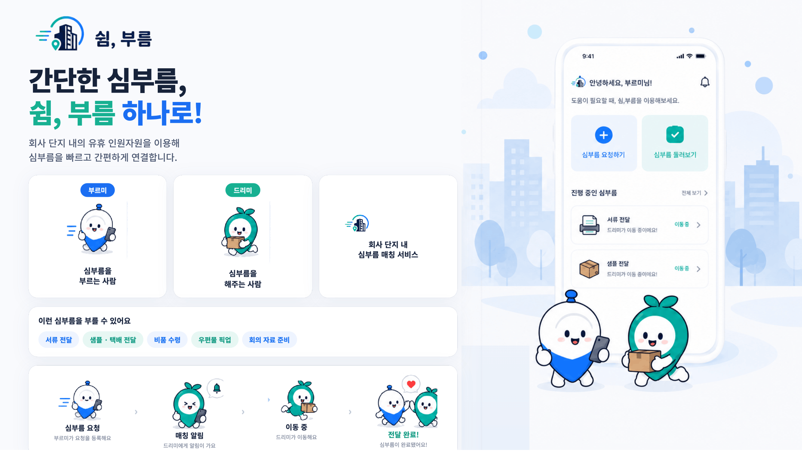
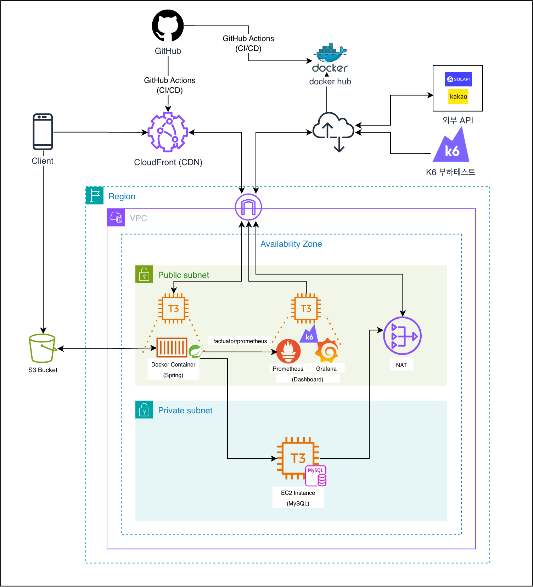

<div align="center">



# 쉼, 부름

**근거리 서류 · 샘플 · 비품을 오가는 사람의 손으로 전하는 P2P 배송 플랫폼**

동선 중 유휴 시간을 가진 직장인이 배송을 수행하고, 필요한 사람은 빠르고 저렴하게 물품을 전달받습니다.
</div>

<div align="center">

### 기획 · 명세

[](https://docs.google.com/spreadsheets/d/1OPN7gDw0_ZbZzS4ikvkhgRhP_cMBv9GLgR7UGgOX0Yo/edit?gid=510946227#gid=510946227)

[](https://pretty-cheque-c57.notion.site/39f19935b8ae809f9890c82e7577c01d?source=copy_link)

### 설계

[](https://www.erdcloud.com/d/Ng9NPXHELZXWPiaoA)
[](https://www.figma.com/design/ERZUfKLiF6VynCX0FmrdhZ/%EC%89%BC-%EB%B6%80%EB%A6%84?node-id=165-1590&t=d5Wr8icAVuTwSpo6-1)

### 협업 · 문서

[](https://github.com/softeerbootcamp-8th/WEB-Team3-NaengSam/wiki)
[](https://github.com/softeerbootcamp-8th/WEB-Team3-NaengSam/discussions)
[](docs/ground_rule.md)


</div>

---

## 👥 팀원

|                         [서석희](https://github.com/seoki180)                         |                          [이동혁](https://github.com/hyeok2044)                           |                           [임현성](https://github.com/hwhyeons)                           |                          [정현서](https://github.com/dlsnfl0615)                           |
|:----------------------------------------------------------------------------------:|:--------------------------------------------------------------------------------------:|:--------------------------------------------------------------------------------------:|:---------------------------------------------------------------------------------------:|
|  |  |  |  |

## 👋 어떤 서비스인가요

한 계정으로 **요청자와 수행자 역할을 스와이프로 전환**하며 겸용할 수 있습니다.
어떤 날은 물건을 보내는 **부르미**, 어떤 날은 오가는 길에 배송하고 보수를 받는 **드리미**가 됩니다.

|                    캐릭터                     |   역할    |     코드명      | 하는 일                            |
|:------------------------------------------:|:-------:|:------------:|---------------------------------|
|  | 🙋 요청자  | **부르미** (P1) | 근거리 서류·샘플·비품 전달이 필요한 사무직 실무자    |
|  | 🛵 수행자  | **드리미** (P2) | 동선 중 유휴 시간에 배송을 수행하고 보수를 받는 직장인 |
|                     —                      | 🛠️ 운영자 |    Admin     | 인증 심사, 신고 처리, 요청 모니터링           |

---

## 🧭 핵심 흐름

```text
부르미 퀵 등록  →  주변 드리미 매칭  →  픽업 인증  →  실시간 추적  →  전달 인증  →  에스크로 정산 · 평점
                          └─ N분 내 미매칭 시 제휴 퀵으로 자동 폴백 ─┘
```

---

## 서비스 아키텍쳐



### ️ Frontend

|      구분      | 기술                            |
|:------------:|-------------------------------|
| **Language** | TypeScript                    |
| **Library**  | React 19                      |
|  **Build**   | Vite 8 · pnpm                 |
|  **State**   | Zustand 5                     |
| **Routing**  | React Router 7                |
| **Styling**  | Tailwind CSS 4                |
|    **기타**    | PWA(vite-plugin-pwa) · ESLint |

### Backend

|       구분        | 기술                                              |
|:---------------:|-------------------------------------------------|
|  **Language**   | Java 21                                         |
|  **Framework**  | Spring Boot 4.1                                 |
|    **Build**    | Gradle                                          |
| **Persistence** | Spring Data JPA · Hibernate · MySQL             |
|  **인증 · 실시간**   | 세션 기반 인증 · SSE(실시간 알림)                          |
|   **API 문서**    | SpringDoc OpenAPI(Swagger)                      |
|    **외부 연동**    | AWS S3 · Kakao Local API(지오코딩) · Solapi(SMS 인증) |
|    **Test**     | JUnit 5 · Mockito · AssertJ · Vitest            |
|     **기타**      | Lombok                                          |

### Infra · DevOps

|      구분       | 기술                  |
|:-------------:|---------------------|
| **Container** | Docker · Docker Hub |
|   **CI/CD**   | GitHub Actions      |
|  **Deploy**   | AWS S3 · CloudFront |

