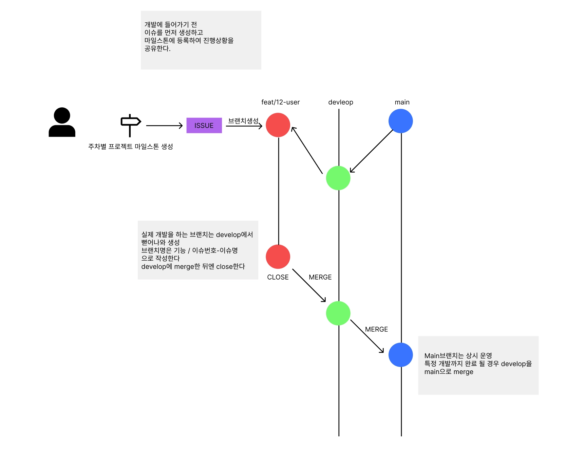

# 소프티어 프로젝트 깃허브 가이드라인

## 커밋 컨벤션 ( Commit Convention )

커밋은 3가지 부분으로 이루어집니다.

```bash
<type> : <header>

<body>

<footer>
```

<type> : 어떤 내용의 커밋인지 선언합니다. 대문자로 시작합니다.

```bash
1. Feat : 기능추가 , 삭제 , 변경
2. Fix : 버그 수정
3. Refactor : 코드 구조 변경, 리팩토링
4. Test :  테스트코드 작성
5. Docs : 문서 작성, 변경
6. Etc : 위에 해당하지 않는 여러 사유, 제목에 상세히 명시
```

<header\> : 커밋의 제목을 선언합니다. ~~구현, ~~수정 등, 단순하고 명확하게 작성합니다.

<body\> : 실제 구현한 내용을 작성합니다. 헤더에서 충분히 설명 되었다면 생략 가능합니다.

<footer\> : 참조할 레퍼런스가 있다면 작성합니다. 생략 가능합니다.

eg)

```bash
Feat : 비밀번호 암호화 추가

user.service에 비밀번호 hash로직을 추가하였습니다.

Issue #1234
```

3가지 부분은 공백으로 구분하여 작성합니다.

## **🤝** 협업



저희 협업은 github - flow를 바탕으로 진행하고자 합니다.

---

### **1. Issue 생성**

- 구현할 기능 또는 작업 단위를 기준으로 **Issue를 생성**합니다.

---

### **2. 브랜치 생성 규칙**

- 모든 기능 개발은 **develop 브랜치에서 분기**합니다.
- ❌**main에는 절대 직접 push 하지 않습니다.**❌
- 브랜치명은 아래 규칙을 따릅니다.

```bash
{type}/{issue번호}
=>
Issue #1 로그인 기능 구현
→ Branch: Feat/1
```

---

### **3. Pull Request & 코드 리뷰**

- 기능 구현 완료 후 **develop 브랜치로 PR**을 생성합니다.
- PR은 **최소 2명 이상의 리뷰**를 받아야 합니다.
- 리뷰 완료 후 승인되면 merge 합니다.

---

### **4. 매일 스크럼 리뷰 및 다음 계획 공유**

- 각 스크럼에서
  - 각자 수행한 작업 내용 공유 및 코드리뷰 수행
