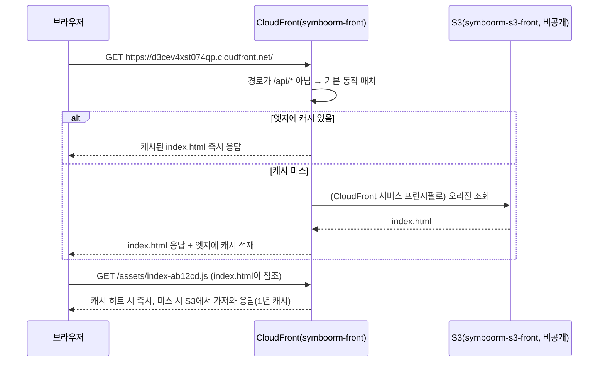
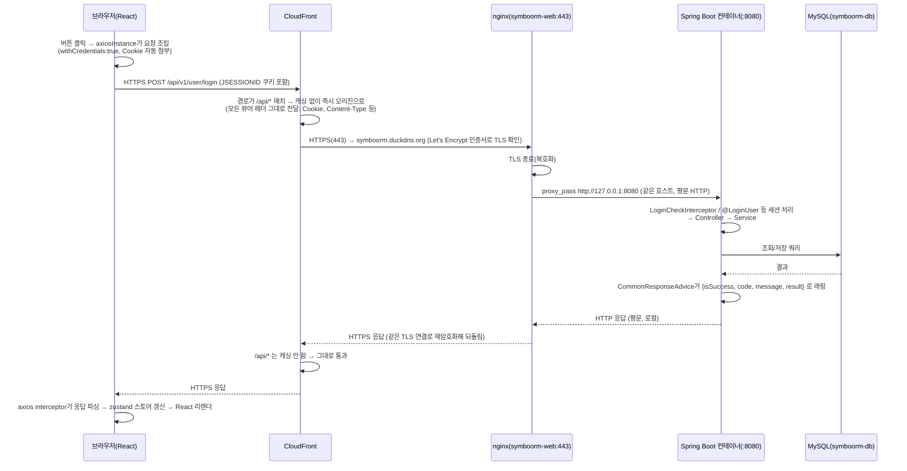

# CloudFront + S3 프론트 배포 & API 요청 흐름

> 근거: `docs/hyeonseo/cicd.md`(EC2 SSH로 직접 확인한 인프라), `.github/workflows/frontend-deploy.yml`,
> `backend/src/main/java/.../global/config/WebConfig.java`, `frontend/src/shared/api/http/*`.
> `frontend/CLAUDE.md`는 "운영 = 교차 출처 직접 호출, CloudFront `/api` 프록시 미사용"이라고 적어뒀지만,
> 실제 인프라(CloudFront 배포 `symboorm-front`, `E2A8PE8JHWO42L`)는 `/api/*` 동작이 존재해 백엔드를
> 프록시한다 — **이 문서는 SSH로 검증된 실제 인프라 기준으로 작성**했다.

---

## 1. CloudFront + S3로 정적 프론트 배포가 어떻게 가능한가

### 1.1 S3 버킷은 비공개다 — CloudFront만 접근 가능

일반적으로 S3로 정적 웹을 호스팅하려면 "정적 웹사이트 호스팅" 기능을 켜고 버킷을 **퍼블릭으로 열어야**
한다. 이 프로젝트는 그렇게 안 한다.

- `symboorm-s3-front` 버킷은 **비공개**로 둔다.
- 버킷 정책에서 **CloudFront 서비스 프린시펄에게만** `GetObject`를 허용한다(`Condition`에 특정
  CloudFront 배포의 ARN이 걸려 있어, 다른 CloudFront 배포나 임의의 사용자는 이 버킷을 못 읽는다).
- 결과: 버킷의 실제 URL(`https://symboorm-s3-front.s3.amazonaws.com/...`)로는 아무도 접근할 수 없고,
  **반드시 CloudFront 도메인을 거쳐야만** 파일을 받을 수 있다.

이렇게 하는 이유는 접근 통제를 한 곳(CloudFront)에 모으기 위해서다 — HTTPS 강제, 캐싱, 접근 제한을
전부 CloudFront 레벨에서 관리할 수 있고, S3는 그저 "CloudFront만 읽을 수 있는 파일 저장소"로 남는다.

### 1.2 배포 파이프라인이 실제로 파일을 올리는 과정

`.github/workflows/frontend-deploy.yml`이 main/develop push(또는 수동 실행)로 트리거된다.

```
1) pnpm build
   - VITE_API_BASE_URL, VITE_KAKAO_MAP_KEY 를 GitHub Secrets에서 주입해 번들 JS에 인라인
   - 결과물: frontend/dist/ (index.html + 해시 붙은 assets/*.js, *.css)

2) appleboy/scp-action 으로 dist/ 를 symboorm-web(EC2) 의 /tmp/frontend-deploy 로 전송
   (GitHub Actions 러너에는 AWS 자격증명을 아예 두지 않음 — 조직 정책상 러너 IP가 S3 접근 차단이라
    직접 못 올림. 그래서 EC2를 한 번 거친다)

3) EC2 안에서 aws s3 cp 실행 (symboorm-web 인스턴스의 IAM 인스턴스 롤 권한으로)
   - 콘텐츠 해시가 붙은 파일(assets/*.js 등): Cache-Control: public, max-age=31536000, immutable
     → 파일명 자체가 해시라 내용이 바뀌면 파일명도 바뀌므로 1년 캐싱해도 안전
   - index.html, sw.js, registerSW.js, manifest.webmanifest: Cache-Control: no-cache,no-store,must-revalidate
     → 해시가 없는 파일이라 오래 캐싱하면 PWA 업데이트가 사용자에게 전달 안 됨

4) aws cloudfront create-invalidation --paths "/*"
   → CloudFront 엣지에 남아있는 이전 index.html 등의 캐시를 강제로 비움
```

### 1.3 CloudFront가 실제로 트래픽을 어떻게 나누는가

CloudFront 배포(`symboorm-front`)는 동작(behavior)이 2개다.

| 경로 패턴 | 오리진 | 캐싱 |
|---|---|---|
| `/api/*` | `symboorm.duckdns.org`(EC2, 커스텀 오리진, HTTPS만 허용) | 비활성(`Managed-CachingDisabled`) — 요청마다 항상 최신 |
| 기본값(`*`) | S3(`symboorm-s3-front`) | 최적화 캐싱(`Managed-CachingOptimized`), HTTP→HTTPS 리다이렉트 |

즉 **하나의 CloudFront 도메인**(`https://d3cev4xst074qp.cloudfront.net`, 커스텀 도메인 없이 CloudFront
기본 도메인 그대로 사용 중)이 경로만 보고 "정적 파일이면 S3로, API 요청이면 백엔드로" 자동으로 나눠준다.
브라우저 입장에서는 **프론트와 백엔드가 같은 출처(origin)처럼** 보인다 — 그래서 이 프로젝트는 CORS를
CloudFront가 대신 회피해주는 구조를 갖고 있다(자세한 내용은 3절).

---

## 2. 정적 리소스가 브라우저에 뜨는 흐름 (첫 진입)



`index.html`은 `no-cache`라 매번 CloudFront가 S3에 최신 버전을 확인하지만, 그 안에서 참조하는
`assets/*.js`는 파일명에 콘텐츠 해시가 박혀 있어 한 번 받으면 1년 동안 그대로 재사용해도 안전하다. 이
조합 덕분에 "배포 직후에도 옛날 파일이 계속 보이는" 캐시 무효화 문제 없이, 배포 안 된 나머지는 최대한
빠르게(엣지 캐시) 서빙된다.

---

## 3. 버튼 클릭 → API 요청 → 서버 → 화면 갱신 (전체 흐름)

여기서부터가 핵심이다. 사용자가 로그인 화면에서 버튼을 누르는 경우를 예로 들되, **모든 API 요청이 공통으로
타는 경로**이므로 다른 화면의 어떤 버튼이든 구조는 동일하다.



### 요청이 지나가는 구간별 설명

1. **브라우저 → CloudFront**: 프론트 코드(`shared/api/http/axiosInstance.ts`)가 만든 axios 인스턴스가
   요청을 보낸다. `withCredentials: true`로 세션 쿠키(JSESSIONID)를 자동으로 실어 보내고, `baseURL`은
   운영 빌드 시 `VITE_API_BASE_URL`(GitHub Secrets에서 빌드 타임에 번들에 인라인됨)이 쓰인다. CloudFront가
   `/api/*`를 같은 도메인 안에서 프록시해주는 구조라, 브라우저는 결국 방금 정적 파일을 받아온 것과
   **같은 CloudFront 도메인**으로 API 요청도 보낸다 — 브라우저 관점에서는 교차 출처 요청이 아니다.

2. **CloudFront → nginx**: CloudFront가 요청 경로를 보고 `/api/*` 동작에 매치시켜, 커스텀 오리진
   `symboorm.duckdns.org:443`으로 넘긴다. 이 구간은 캐싱이 완전히 꺼져 있고(`Managed-CachingDisabled`),
   `Cookie`를 포함한 모든 뷰어 헤더를 그대로 전달한다(`Managed-AllViewer`) — 그래야 세션 쿠키가 백엔드까지
   안 끊기고 도달한다. CloudFront가 오리진에 HTTPS로만 붙도록 강제돼 있어서, 오리진 쪽에 유효한 TLS
   인증서를 든 서버가 필요하다.

3. **nginx의 역할**: `symboorm-web` EC2 인스턴스에 **컨테이너가 아니라 OS에 직접** 설치돼 있다. Let's
   Encrypt(certbot) 인증서로 443 포트에서 TLS를 종료(복호화)한 뒤, `proxy_pass http://127.0.0.1:8080`으로
   **같은 호스트 안의 loopback**을 통해 백엔드 컨테이너로 넘긴다. 백엔드(Spring Boot 내장 톰캣) 자체는
   TLS를 처리하지 않으므로, nginx가 없으면 CloudFront가 요구하는 "오리진은 HTTPS만" 조건을 만족시킬
   수 없다. 즉 **nginx의 존재 이유는 전적으로 TLS 종료**다. (SSE처럼 오래 붙잡는 연결이 몰릴 때는 nginx의
   `worker_connections`가 병목이 될 수 있다는 점도 이전에 확인한 바 있다 — 자세한 메커니즘은 4.4절.)

4. **nginx → 백엔드 컨테이너**: 평문 HTTP다. 네트워크에 노출되지 않는 loopback(127.0.0.1) 구간이라
   암호화하지 않아도 안전하다고 판단한 것.

5. **백엔드 내부**: `DispatcherServlet`이 요청을 받아 `LoginCheckInterceptor`(세션 검사) →
   `HandlerMethodArgumentResolver`(`@LoginUser` 등 파라미터 주입) → 컨트롤러 → 서비스 → 리포지토리(MySQL,
   `symboorm-db` 프라이빗 서브넷) 순으로 처리한다. 컨트롤러가 반환한 DTO는 `CommonResponseAdvice`가
   `{isSuccess, code, message, result}` 봉투로 감싸고, 예외가 났다면 `GlobalExceptionHandler`가 같은
   포맷의 에러 응답을 만든다.

6. **응답이 돌아오는 길**: 백엔드 → nginx(평문) → nginx가 CloudFront와 맺어둔 **같은 TLS 연결로 재암호화해
   전달** → CloudFront(`/api/*`라 캐싱하지 않고 그대로 통과) → 브라우저. 브라우저에서는
   `axiosInstance`의 응답 인터셉터가 실패 응답을 `ApiError`로 정규화하고(세션 만료 코드 `AUTH_001~003`이면
   전역 로그인 리다이렉트 트리거), 성공 응답은 `customInstance`가 `response.data`를 그대로 돌려줘서 호출부가
   `const { result } = await api.xxx()`로 접근한다.

7. **화면 갱신**: 호출부(예: `sessionStore.login`)가 받은 `result`로 zustand 스토어 상태를 바꾸면, 그
   상태를 구독하는 React 컴포넌트들이 리렌더링되어 화면이 갱신된다.

---

## 4. nginx는 지금 정확히 어떻게 쓰이고 있는가

먼저 질문에 대한 답부터: **맞다.** 흐름은 정확히 "브라우저 → CloudFront → (`/api/*`면) nginx가 먼저
받음 → nginx가 Spring Boot로 넘겨줌"이다. CloudFront가 백엔드 컨테이너(8080 포트)로 직접 요청을
쏘는 게 아니라, 반드시 nginx를 한 번 거친 뒤에야 백엔드에 도달한다. 3절 시퀀스 다이어그램의
`CF->>NG` → `NG->>BE` 두 화살표가 그 순서 그대로다.

### 4.1 nginx를 앞에 두는 일반적인 이유들

리버스 프록시로 nginx를 쓰는 이유는 보통 이 중 몇 가지(또는 전부) 때문이다.

- **TLS 종료(TLS termination)**: HTTPS 인증서 관리·암호화/복호화를 프록시 한 곳에 몰아, 뒷단
  애플리케이션 서버는 TLS를 신경 쓸 필요 없이 평문 HTTP만 처리하게 한다.
- **로드밸런싱**: 애플리케이션 서버가 여러 대일 때, nginx가 요청을 여러 인스턴스로 분산한다.
- **정적 파일 서빙**: 이미지·JS·CSS 같은 정적 자원을 애플리케이션 서버(톰캣, Node 등)보다 훨씬
  가볍고 빠르게 nginx가 직접 서빙한다.
- **리버스 프록시/경로 라우팅**: 여러 서비스를 하나의 IP·포트 뒤에 두고, 경로나 서브도메인 기준으로
  적절한 백엔드로 분기한다.
- **레이트 리밋·커넥션 제한·gzip 압축·요청 버퍼링**: 애플리케이션 서버에 닿기 전에 트래픽을 다듬는다.
- **공격 표면 축소**: 애플리케이션 서버를 인터넷에 직접 노출하지 않고, 검증된 프록시 하나만 외부에
  열어둔다.

### 4.2 이 프로젝트가 실제로 쓰는 이유 — 딱 하나, TLS 종료

`symboorm-web` 인스턴스의 nginx 설정(`cicd.md` 3.2절, SSH로 직접 확인)을 보면 역할이 아주 좁다.

```nginx
listen 443 ssl;   # certbot이 추가
ssl_certificate     /etc/letsencrypt/live/symboorm.duckdns.org/fullchain.pem
ssl_certificate_key /etc/letsencrypt/live/symboorm.duckdns.org/privkey.pem
listen 80;
server_name symboorm.duckdns.org;
proxy_pass http://127.0.0.1:8080;   # 둘 다 백엔드 컨테이너로
```

이 프로젝트가 nginx를 쓰는 이유는 위 일반적인 이유 목록 중 **TLS 종료 단 하나**다.

- **왜 필요한가**: CloudFront의 `/api/*` 동작은 오리진 프로토콜을 "HTTPS만"으로 강제해뒀다(1.3절
  표). 즉 CloudFront가 오리진(`symboorm.duckdns.org`)에 붙을 때 반드시 유효한 TLS 인증서로 응답하는
  서버가 있어야 한다. 그런데 Spring Boot 내장 톰캣 자체는 기본적으로 TLS를 하지 않는다(기술적으로는
  키스토어를 설정해 톰캣이 직접 443을 물 수도 있지만, 인증서 발급·자동 갱신 도구(certbot)가 nginx를
  전제로 만들어져 있어 nginx를 쓰는 편이 훨씬 간단하다). 그래서 nginx가 그 앞단에서 Let's
  Encrypt(certbot) 인증서로 443 포트를 받아 TLS를 복호화한 뒤, `proxy_pass`로 같은 호스트 안의
  loopback(`127.0.0.1:8080`)을 통해 평문 HTTP로 백엔드 컨테이너에 넘긴다.
- **80 포트도 열어두는 이유**: CloudFront가 오리진에 평문 HTTP로 오는 경우는 없다(HTTPS만 강제). 80은
  certbot이 인증서를 처음 발급·갱신할 때 쓰는 HTTP-01 챌린지(도메인 소유권 검증)를 위한 것이다.
- **로드밸런싱은 하지 않는다**: 백엔드 컨테이너가 `symboorm-web` 인스턴스 한 대에만 떠 있어서(단일
  인스턴스), 분산시킬 대상 자체가 없다. `proxy_pass`가 가리키는 곳도 항상 같은 로컬 컨테이너 하나뿐.
- **정적 파일 서빙도 하지 않는다**: 정적 자산은 nginx가 아니라 S3 + CloudFront가 전담한다(1~2절).
  nginx는 순수하게 `/api/*` API 트래픽만 본다.

정리하면, 일반적으로 nginx가 할 수 있는 여러 역할(TLS 종료·로드밸런싱·정적 서빙·라우팅·레이트 리밋
등) 중에서 이 프로젝트는 **"CloudFront가 요구하는 HTTPS 오리진 조건을 만족시키기 위한 TLS 종료"** 딱
하나만을 위해 nginx를 최소 구성으로 쓰고 있다.

### 4.3 왜 CloudFront가 백엔드로 직접 못 가고 nginx를 거쳐야 하는가

CloudFront `/api/*` 동작은 "오리진에 HTTPS로만 연결한다"는 설정이 걸려 있다(1.3절). 만약 nginx 없이
CloudFront가 백엔드 컨테이너(8080, 평문 HTTP)로 바로 붙이려 하면, 오리진이 HTTPS 인증서로 응답하지
않기 때문에 CloudFront가 연결 자체를 거부한다. 즉 **nginx가 없으면 이 배포 구조 자체가 성립하지
않는다** — TLS 인증서를 들고 443에서 응답해줄 무언가가 CloudFront와 백엔드 사이에 반드시 있어야 하고,
그 역할을 nginx가 맡고 있다.

### 4.4 SSE 부하테스트에서 겪은 worker_connections 문제, 정확히 뭔 소리인가

**nginx의 연결 처리 모델**: nginx는 CPU 코어 수만큼 워커 프로세스를 띄우고, 각 워커가 이벤트 루프
(Linux epoll)로 동시에 여러 연결을 처리한다. 이때 워커 하나가 동시에 열어둘 수 있는 **소켓(연결) 개수
상한**이 `worker_connections`다. 그런데 nginx가 **리버스 프록시**로 동작할 때는, 요청 하나를 중계하는
동안 이 상한 안에서 소켓을 **2개** 소비한다 — ① 클라이언트 ↔ nginx 소켓, ② nginx ↔ 백엔드(업스트림)
소켓. 이 둘이 짝을 이뤄야 "중계"가 성립하기 때문이다.

일반적인 REST 요청은 응답이 오면(보통 수십~수백 ms 안에) 이 소켓 2개를 즉시 반납한다. 그래서
`worker_connections`가 크지 않아도 처리량 자체는 매우 높게 나온다 — 회전율이 빠르니까. 문제는 **SSE
연결은 반납되지 않는다**는 점이다. 이 프로젝트의 SSE는 `sse.connection-timeout=1h`로 계정이 로그인해
있는 동안 계속 열려 있게 설계돼 있어서, 접속 중인 사용자 한 명이 소켓 2개를 **접속해 있는 내내
독점**한다. 동시 접속자가 늘어날수록 이 점유량은 누적만 되고 절대 안 줄어든다. 2026-08-18
부하테스트에서 SSE 동시 연결 701개가 뜨자 필요한 소켓이 701 × 2 = 1,402개였는데, nginx 기본값
`worker_connections 768`(× 워커 2개)로는 부족해서 `error.log`에 경고가 찍혔고, 값을 2048로 올려서
해결했다(`cicd.md` 3.2절).

**정정할 부분**: 지난 답변에서 "nginx를 선택한 덕분에 이 문제에 유연하게 대응할 수 있었다"고
표현했는데, 더 정확히 말하면 이건 **nginx라서 얻은 이점이 아니라 nginx를 리버스 프록시로 얹었기
때문에 새로 생긴 비용**이었다. 실제로 `application.properties`(90번째 줄 근처)에 이런 주석이 있다.

```
# SSE 는 Servlet async 라 톰캣 워커를 점유하지 않으므로 이 상한과 무관하다.
server.tomcat.threads.max=100
```

즉 **백엔드(Spring Boot 내장 톰캣) 입장에서는 SSE 연결이 스레드를 하나도 점유하지 않는다**(Servlet
3.0 비동기 처리라 커넥션이 열려 있어도 워커 스레드를 반납한다). 만약 nginx 없이 CloudFront가 톰캣에
직접(또는 ALB를 거쳐) 붙는 구조였다면, 이 "소켓 2개 곱하기" 문제 자체가 애초에 없었을 수도 있다 —
nginx의 동기식 워커 모델이 프록시 구간에 새로 만들어 낸 병목이지, 톰캣 자체의 한계가 아니었다.

그럼 "nginx를 고른 게 잘한 일"이라고 할 근거가 전혀 없느냐 하면, 그건 아니다. 정확한 이점은 이거다:
**문제가 생겼을 때 원인 파악과 수정이 전부 우리 손 안에서 끝났다.** nginx는 우리가 직접 설치·설정한
오픈소스 설정 파일이라 `error.log`를 보고 원인을 바로 특정할 수 있었고, 숫자 하나(`worker_connections
768 → 2048`) 바꾸고 `reload` 한 번으로 끝났다. 만약 ALB였다면 이 정도 동시 연결 규모에서 ALB 자체가
막힐 가능성은 낮지만(완전 관리형이라 이 레이어의 용량을 AWS가 알아서 스케일함), 대신 원인 진단이
블랙박스가 되고 우리가 직접 만질 수 있는 레버도 적었을 것이다. 요약하면: **"nginx가 이 문제를 만들었지만,
nginx였기 때문에 이 문제를 빠르고 투명하게 고칠 수 있었다"**가 정확한 표현이다.

### 4.5 nginx 대신 다른 방법을 썼다면 — 대안별 트레이드오프

"TLS 종료가 목적이었다면 다른 방법도 있지 않았냐"는 질문에는 이렇게 답할 수 있다: 맞다, 있었다. 다만
각각 트레이드오프가 있어서 nginx+certbot을 골랐다.

| 대안 | 방식 | 장점 | 단점 / 이 프로젝트가 안 쓴 이유 |
|---|---|---|---|
| **Spring Boot(내장 톰캣) 직접 TLS** | `server.ssl.key-store`로 톰캣이 443을 직접 처리 | 구성 요소가 하나 줄어듦(nginx 자체가 불필요) | Let's Encrypt는 PEM, 자바는 PKCS12/JKS라 형식 변환 필요. 인증서 교체 시 예전엔 JVM 재시작이 필요해 SSE처럼 오래 붙잡는 연결이 전부 끊김(Spring Boot 3.1+ SSL 번들 재로딩으로 완화 가능하지만 별도 구성 필요) |
| **ALB(Application Load Balancer) + ACM** | ALB가 TLS 종료, EC2에는 평문으로 전달 | 인증서 발급·자동 갱신을 AWS가 완전히 관리(만료 걱정 없음), 연결 용량도 AWS가 알아서 스케일 | 시간당 요금 + 처리량(LCU) 과금이 붙는 유료 서비스. ACM 인증서는 원칙적으로 AWS 관리형 리소스에만 붙일 수 있어 EC2 단독으로는 못 씀 |
| **Caddy 같은 경량 프록시** | nginx 자리에 Caddy를 대신 사용 | Let's Encrypt 발급·자동 갱신·무중단 교체가 기본 동작(별도 certbot 연동 불필요) | nginx보다 생태계·운영 경험이 적어, 이후 SSE 튜닝 같은 문제 해결 시 참고할 자료가 상대적으로 적음 |
| **CloudFront 오리진 프로토콜을 HTTP Only로 변경** | 오리진에 HTTPS를 아예 요구하지 않음 → nginx 자체가 불필요 | 구성이 가장 단순해짐 | CloudFront-EC2 구간이 평문이 되어, 세션 쿠키를 포함한 API 트래픽이 그 구간에서 암호화 없이 흐름 — 보안상 일부러 배제한 선택지 |

**결론적으로 쓸 수 있는 답변**: "비용을 최소화해야 하는 프로젝트 규모(t3.micro 단일 인스턴스)에서
무료로 무중단 인증서 자동 갱신이 되는 nginx+certbot을 택했습니다. 트래픽이 커지면 ALB+ACM으로
옮겨서 인증서 관리와 연결 용량 스케일링을 AWS에 완전히 맡기는 게 다음 단계라고 생각합니다."

---

## 5. 정적 자산 요청과 API 요청의 차이 한눈에

| | 정적 자산 (`GET /`, `/assets/*.js`) | API 요청 (`/api/v1/*`) |
|---|---|---|
| CloudFront 오리진 | S3(`symboorm-s3-front`) | nginx(`symboorm.duckdns.org`) |
| 캐싱 | 있음(해시 파일은 1년, `index.html`은 무캐시) | 없음(`Managed-CachingDisabled`) |
| nginx를 거치는가 | 아니오 | 예 |
| 백엔드/DB를 거치는가 | 아니오 | 예 |
| 세션 쿠키가 필요한가 | 아니오 | 예(대부분) |
| TLS가 몇 번 걸리는가 | 브라우저 ↔ CloudFront 1회 | 브라우저 ↔ CloudFront, CloudFront ↔ nginx 총 2회 (nginx ↔ 백엔드 구간은 평문) |

---

## 6. 왜 이렇게 설계했는가 (요약)

- **S3를 비공개로 두고 CloudFront만 접근 허용**: 접근 통제·HTTPS 강제·캐싱을 CloudFront 한 곳에서 관리하기
  위해서. S3 정적 웹호스팅의 "버킷 퍼블릭" 요구를 피할 수 있다.
- **CloudFront가 `/api/*`도 같은 도메인에서 프록시**: 프론트·백엔드가 브라우저 입장에서 동일 출처처럼
  동작해, CORS 문제를 CloudFront 레벨에서 회피한다.
- **`/api/*`만 캐싱을 끔**: API 응답은 매 요청 최신이어야 하므로, 정적 자산과 캐싱 정책을 분리했다.
- **nginx가 TLS를 전담**: CloudFront가 오리진에 HTTPS만 허용하도록 강제해뒀기 때문에, 백엔드 컨테이너
  자체가 TLS를 구현하지 않아도 되도록 앞단에 뒀다.
- **배포는 EC2를 경유**: GitHub Actions 러너에는 AWS 자격증명을 두지 않고, S3/CloudFront 접근 권한은
  EC2 인스턴스 롤에만 부여해 자격증명 노출 범위를 최소화했다.
