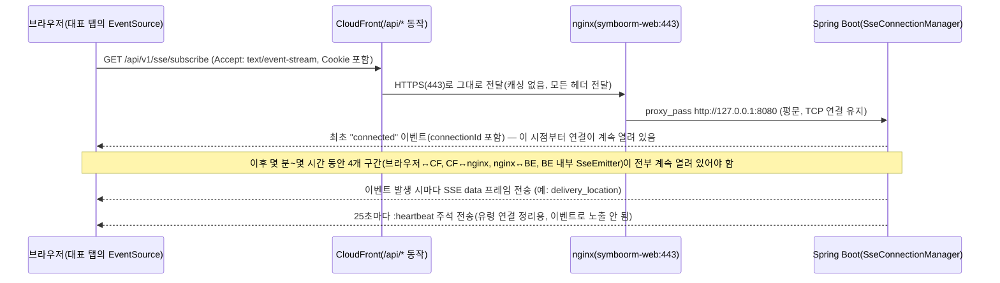

# SSE와 폴링 정리

이 프로젝트에서 폴링과 SSE가 실제로 어디에 쓰이는지, SSE가 CloudFront/nginx/S3를 낀 배포 구조에서
어떤 경로로 전달되는지, 그리고 SSE 연결이 유실되는 상황과 그 대비책을 정리.

> 관련 문서: [CloudFront S3 배포와 API 요청 흐름.md](./CloudFront S3 배포와 API 요청 흐름.md),
> [global-package.md](./global-package.md)(§7 sse, §8 notification)

---

## 1. 폴링이 쓰이는 곳

**질문하신 대로 맞다** — 이 프로젝트의 폴링은 전부 "클라이언트가 몇 초마다 일반 `/api/*` REST
요청을 보내고 응답을 받아오는" 방식이다. SSE처럼 연결을 유지하는 특수한 프로토콜이 아니라, 그냥
`setInterval`로 평범한 axios 요청을 반복 호출하는 것뿐이다. 두 군데에서 쓰인다.

### 1.1 로그인 대기열 폴링 — 진짜 "순번 조회"용 폴링

동시 로그인이 몰려 대기열에 걸리면(`domain.user.service.LoginQueue`), 프론트는
`POST /api/v1/user/login/queue/{ticketId}`를 서버가 알려준 `pollAfterMs` 간격으로 반복 호출한다
(`sessionStore.waitInQueue`, `LoginQueue.poll`). 순번이 줄면 서버가 더 짧은 `pollAfterMs`를 내려줘서
폴링 주기가 자동으로 촘촘해진다. (이건 지난 로그인 흐름 정리에서 이미 다룬 내용.)

### 1.2 SSE 재연결 동안의 상태 복구 폴링 — 이번 문서의 핵심

**매칭 화면**(`matchingStore.ts`)과 **배달 추적 화면**(`RealDeliveryTracking.tsx`)은 SSE가 정상
연결(`connected`)돼 있는 동안은 폴링을 하지 않는다. 하지만 SSE가 **일시적으로 끊긴 상태
(`reconnecting`)**가 되면, `MATCHING_POLL_INTERVAL_MS = 3_000`(3초) 간격으로 `setInterval`을 돌려
REST API(`syncCurrentMatching()`, `refreshDeliveryDetail()`)를 반복 호출해 화면을 최신 상태로
맞춘다. 이 로직은 화면마다 따로 구현하지 않고 `useSseReconnectSync` 공용 훅으로 일반화돼 있다
(`frontend/src/shared/lib/sse/useSseReconnectSync.ts`).

```ts
// useSseReconnectSync.ts 핵심 로직
if (!enabled || status !== "reconnecting") return;
const id = window.setInterval(() => recoverRef.current(), SSE_RECONNECT_POLL_INTERVAL_MS); // 3000ms
```

즉 "SSE가 살아 있을 땐 SSE로, 끊기면 그동안만 폴링으로" 서로 자연스럽게 역할을 넘겨받는 구조다. SSE가
다시 `connected`로 돌아오면 폴링을 즉시 멈추고, 놓쳤을 수 있는 상태를 마지막으로 한 번 더 동기화한다
(4.3절에서 자세히).

### 1.3 (참고) 폴링이 아닌 "주기적 push" — 드리미 GPS 위치 전송

방향이 반대라 폴링과 헷갈리기 쉬운데, 드리미 앱이 배달 중 **5초 간격으로 자신의 위치를 서버에
POST하는 것**(`useDreamiLocationBroadcast.ts`)은 폴링이 아니다. 폴링은 "클라이언트가 서버 상태를
당겨오는 것"이고, 이건 "클라이언트가 서버에 계속 데이터를 밀어 넣는 것"이라 방향이 정반대다. 서버는
이렇게 쌓인 위치를 부르미에게는 SSE(`DELIVERY_LOCATION` 이벤트)로 실시간 전달한다.

---

## 2. SSE가 쓰이는 곳

### 백엔드

- **`global.sse`**(인프라): `SseController`(구독/해제 엔드포인트), `SseConnectionManager`(연결
  생명주기), `SseService`(단일 가상 스레드로 순서 보장 전송), `ActiveSessionRegistry`(계정당 연결
  1개 관리) — 이전 대화에서 정리한 그대로.
- **이벤트 카탈로그**: 각 도메인이 `SseEventType`을 구현한 enum으로 자신의 이벤트를 정의한다.
  - `domain.matching.event.MatchingEventType`: `OFFER_POPUP`, `OFFER_CLOSED`, `DREAMI_INFO`,
    `BOORMI_REJECTED` 등 — 매칭 오퍼 알림.
  - `domain.delivery.event.DeliveryEventType`: `DELIVERY_LOCATION`(위치 갱신),
    `DELIVERY_STARTED_BOORMI`/`DELIVERY_STARTED_DREAMI`, `DELIVERY_DELIVERING`, `DELIVERY_CANCELLED`,
    `DELIVERY_COMPLETED`, `DELIVERY_DREAMI_OFFLINE`(드리미 무소식), `DELIVERY_PING`(부르미가 드리미를
    깨우는 신호), `DELIVERY_ETA_UNAVAILABLE` 등.
- **`global.notification`**: 이 이벤트들을 인앱(SSE)으로만 보낼지, 웹푸시까지 같이 태울지 정책표로
  결정한다(이전 대화에서 정리한 `NotificationPolicy`).

### 프론트엔드

- **`shared/lib/sse/SseProvider.tsx`**: 앱 전역에 하나 있는 SSE 연결의 provider. `EventSource`를
  직접 만든다(`new EventSource("/api/v1/sse/subscribe", { withCredentials: true })`).
- **`shared/lib/sse/SseTabCoordinator.ts`**: 브라우저 탭이 여러 개 떠 있어도 **Web Locks API로 대표
  탭 하나만** 실제 서버 연결을 갖게 하고, 나머지 탭은 **`BroadcastChannel`**로 대표 탭의 이벤트를
  전달받는다(3절 뒤에서 자세히 다룸).
- **`useSseReconnectSync`**: 화면별로 재사용하는 재연결 복구 훅(1.2절).

### 2.1 BroadcastChannel이란

`SseTabCoordinator`가 여러 탭을 조율하는 데 쓰는 `BroadcastChannel`은 **서버와는 전혀 무관한, 브라우저
안에서만 도는 순수 로컬 API**다. 같은 출처(origin)의 서로 다른 브라우징 컨텍스트(탭, 창, iframe,
워커)끼리 메시지를 주고받게 해주는 표준 웹 API로, 네트워크 요청이 전혀 안 나간다.

```js
// 탭 A
const ch = new BroadcastChannel("my-channel");
ch.postMessage({ hello: "world" });

// 탭 B (같은 출처의 다른 탭)
const ch = new BroadcastChannel("my-channel");
ch.addEventListener("message", (e) => console.log(e.data)); // { hello: "world" }
```

같은 브라우저 프로세스 안에서 브라우저가 알아서 탭 간에 메시지를 전달해주는 것뿐이라, `localStorage`
이벤트로 탭 간 통신을 흉내 내던 예전 방식보다 깔끔한 정식 API다.

이 프로젝트는 정확히 이 성질(서버와 무관, 같은 출처 탭끼리만)을 이용한다 — 대표 탭 하나만 실제
`EventSource`(서버와의 진짜 네트워크 연결)를 갖고, 그 탭이 받은 이벤트를
`BroadcastChannel.postMessage(...)`로 같은 브라우저의 다른 탭들에게 뿌려준다. 나머지 탭들은 서버에
아무 연결도 안 하고 그냥 이 로컬 메시지만 듣고 있는다.

### 2.2 SSE 연결 수는 클라이언트 개수와 같은가

**일반적으로는 그렇다** — 보통 SSE를 쓰는 앱이면 `new EventSource(...)`를 호출하는 탭/클라이언트마다
서버에 연결이 하나씩 생기니, 순진하게는 "동시 접속 탭 수 = 서버가 들고 있는 연결 수"가 맞다.

**하지만 이 프로젝트는 의도적으로 다르다.** 두 겹으로 줄여놨다.

1. **계정 레벨**: `ActiveSessionRegistry`가 **계정당 활성 연결을 최대 1개**로 강제한다. 같은 계정으로
   다른 기기/브라우저에서 로그인하면 이전 연결은 즉시 끊긴다(`REPLACED_BY_LOGIN`).
2. **탭 레벨**: 같은 브라우저 안에서 탭을 여러 개 열어도, `SseTabCoordinator`가 Web Locks API로 그중
   **딱 하나만 대표로 뽑아** 서버 연결을 갖게 하고, 나머지는 위 `BroadcastChannel`로만 데이터를 받는다.

그래서 실제로는:

> **서버가 들고 있는 SSE 연결 수 = 지금 브라우저 세션이 살아있는 상태로 로그인 중인 "계정" 수**

이고, 그 계정이 탭을 몇 개 열었든 브라우저 몇 개를 켰든 상관없이 연결은 1개다. 원래는 탭마다 따로
연결을 만들다가 서로 밀어내며 유령 연결이 남는 문제가 있었고, 한때는 계정당 최대 5개까지 허용했다가
지금의 "1탭이 대표, 나머지는 BroadcastChannel" 구조로 정리됐다(4.3절 5번 참고).

---

## 3. CloudFront/nginx가 낀 구조에서 SSE는 어떤 흐름으로 전달되나

### 3.0 SSE는 HTTP 요청/응답이 몇 개인가 — "끝나지 않는 응답 하나"

SSE는 **구독용 API와 데이터용 API가 따로 있는 게 아니다.** 구독 요청 자체가 바로 데이터를 받는
커넥션이 된다.

클라이언트가(보통 브라우저의 `EventSource`로) `GET /subscribe` 같은 엔드포인트에 HTTP 요청을 **한
번** 보낸다. 서버는 `200 OK`와 `Content-Type: text/event-stream` 헤더까지만 먼저 응답하고, 응답
바디는 끝내지 않은 채로 커넥션을 계속 열어둔다. 이후 이벤트가 생길 때마다 `data: ...\n\n` 형식의
텍스트를 그 바디에 계속 흘려보내는(flush) 방식이다. 즉 **요청/응답 쌍은 처음부터 끝까지 1개**이고,
그 응답이 "아직 끝나지 않은 상태"로 계속 유지되는 것뿐이다. 별도의 데이터 전송용 HTTP가 하나 더
생기지 않는다.

**응답을 안 끝내고 살려두는 방법**: HTTP 응답이 "끝난다"는 건 두 경우다 — `Content-Length`만큼 다
보냈거나, `Transfer-Encoding: chunked`에서 크기 0짜리 종료 청크를 보낸 경우. SSE는 애초에
`Content-Length`를 지정하지 않고 `chunked` 인코딩(혹은 HTTP/2 스트림)을 사용해서, 서버가 종료 청크를
보내지 않는 한 응답이 "진행 중"인 상태로 계속 남아있게 만든다. 서버 구현 입장에서는 이 커넥션을
처리하는 스레드가 계속 블로킹되어 있으면 자원 낭비가 크기 때문에, 보통 비동기(async) 방식으로
처리한다.

**Spring Boot에서는 `SseEmitter`로 이걸 구현한다** — 컨트롤러가 `SseEmitter`를 즉시 반환해서 서블릿
스레드는 반납하고, 별도 스레드(이 프로젝트는 `SseService`의 단일 가상 스레드)에서 `emitter.send(...)`를
호출할 때마다 그 데이터가 열려있는 커넥션으로 흘러나간다. 연결을 끝내고 싶을 때만
`emitter.complete()`를 호출한다.

```java
@GetMapping(value = "/subscribe", produces = MediaType.TEXT_EVENT_STREAM_VALUE)
public SseEmitter subscribe() {
    SseEmitter emitter = new SseEmitter(0L); // timeout 없이 유지
    // 별도 스레드/스케줄러에서 이벤트 발생 시마다
    // emitter.send(SseEmitter.event().data(payload));
    // 끝내고 싶을 때 emitter.complete();
    return emitter;
}
```

(WebFlux를 쓴다면 `Flux<ServerSentEvent<T>>`를 리턴하는 방식이 더 자연스럽고, non-blocking이라 스레드
점유 문제도 없다. 이 프로젝트는 Spring MVC + `SseEmitter` 방식이다.)

**방향성 주의점**: SSE는 **서버 → 클라이언트 단방향**이다. 클라이언트가 서버에 뭔가 보내야 한다면
(구독 갱신, 필터 변경, 명시적 연결 해제 등) 그건 이 SSE 커넥션을 통해서가 아니라 별도의 일반 HTTP
요청으로 보내야 한다(이 프로젝트에서는 `POST /api/v1/sse/disconnect`가 그 예다). 그런 의미에서는
"API 2개"가 있을 수 있는데, 그건 데이터 수신용/송신용이 나뉘는 것이지 **데이터 수신 자체가 구독
요청과 별개의 커넥션인 건 아니다.**

참고로 브라우저 `EventSource`는 연결이 끊기면 `Last-Event-ID` 헤더를 담아 자동으로 재연결을
시도한다(다만 이 프로젝트는 서버가 이 헤더로 놓친 이벤트를 재생해주는 기능까지는 구현하지 않았다 —
4.2절 참고).

### 3.1 이 프로젝트의 배포 구조에서 실제로 거치는 경로

**S3는 이 흐름에 전혀 관여하지 않는다** — S3는 정적 프론트 자산(HTML/JS/CSS)만 서빙하고, SSE
스트림은 API 트래픽이라 CloudFront의 `/api/*` 동작(오리진 = nginx → Spring Boot)을 그대로 탄다. 즉
SSE 요청이 지나가는 경로는 일반 API 요청과 **경로 자체는 완전히 동일**하다 — 다른 건 이 연결이
**응답 한 번 받고 끝나는 게 아니라 계속 열려 있다는 점**뿐이다.



핵심은 **일반 REST 요청과 달리 이 왕복 전체(4개 구간)가 SSE 연결이 살아있는 내내 동시에 열려 있어야
한다**는 점이다. 이 구조에서 SSE가 정상 동작하려면 중간의 모든 레이어가 "이 연결을 섣불리 끊거나
버퍼링하지 않아야" 한다.

- **CloudFront**: `/api/*` 동작이 캐싱을 완전히 꺼둔 덕분에(`Managed-CachingDisabled`), 응답을
  통째로 캐시해서 굳혀버리는 사고는 안 난다.
- **nginx**: 프록시로서 SSE 연결 하나당 소켓을 2개(클라이언트↔nginx, nginx↔백엔드) 계속 붙잡고
  있어야 한다. 동시 접속자가 늘면 이 소켓 점유가 계속 누적되는데, 이게 정확히 지난번 다룬
  `worker_connections` 부하테스트 사례의 원인이다.
- **Spring Boot**: `SseEmitter`(Servlet 3.0 비동기)가 톰캣 워커 스레드를 점유하지 않은 채 연결을
  계속 열어둔다. 실제 전송은 `SseService`의 단일 가상 스레드가 담당한다.

### 3.2 서버 → 클라이언트로 나가는 데이터도 nginx/CloudFront를 거치는가

**그렇다, 반드시 거친다.** 3.0절에서 봤듯 SSE는 "서버가 클라이언트한테 별도의 새 채널을 열어서 쏘는
것"이 아니라 **애초에 맺어진 하나의 HTTP 응답을, 끝내지 않고 계속 이어서 쓰는 것**뿐이다. 최초
`GET /subscribe` 요청이 CloudFront → nginx → Spring Boot로 프록시되는 순간, 그 경로의 TCP/TLS
소켓들이 전부 그대로 이어져 있는 상태가 된다. 서버가 나중에 `emitter.send(...)`를 호출해서 이벤트를
하나 보낼 때마다, 그 바이트는 **이미 열려 있는 바로 그 응답 스트림에 계속 이어서 쓰이는 것**이고, 그걸
nginx가 즉시 CloudFront로, CloudFront가 즉시 브라우저로 그대로 흘려보낸다(`/api/*`는 캐싱을 꺼뒀기
때문에 버퍼링 없이 바로 통과된다).

즉 **연결을 새로 맺는 과정**(최초 구독 요청)만 CloudFront/nginx를 거치는 게 아니라, **그 연결을 통해
오가는 모든 이벤트 데이터**도 매번 같은 경로를 실제로 통과한다. 이게 바로 nginx `worker_connections`
문제(3.1절 참고)의 근본 원인이기도 하다 — 소켓을 "요청 한 번 처리하고 반납"하는 게 아니라, 이 연결이
열려 있는 몇 시간 내내 nginx가 소켓 2개(클라이언트↔nginx, nginx↔백엔드)를 계속 붙잡고 있어야 하기
때문이다. 만약 중간에 nginx나 CloudFront가 이 연결을 끊어버리면, 서버가 아무리
`emitter.send(...)`를 호출해도 그 데이터는 클라이언트에 절대 도달하지 못한다 — 그래서 heartbeat와
자동 재연결 대응(4절)이 필요하다.

---

## 4. SSE가 유실되는 상황과 그 대비

### 4.1 어떤 상황에서 유실되는가

| 원인 | 구체적 상황 |
|---|---|
| 네트워크 순단 | 와이파이↔모바일 데이터 전환, 터널·엘리베이터 진입, 일시적 신호 저하 |
| 프록시/브라우저의 유휴(idle) 타임아웃 | 오래 데이터가 없는 연결을 CloudFront/nginx/브라우저가 죽었다고 판단해 끊음 |
| 탭/앱이 백그라운드로 감 | 모바일 브라우저가 배터리 절약을 위해 백그라운드 탭의 네트워크 연결을 정리 |
| 서버 재배포·재시작 | JVM이 내려가면 그 순간 모든 `SseEmitter`가 강제 종료됨(무중단 배포가 아닌 한) |
| 다른 기기에서 재로그인 | `ActiveSessionRegistry`가 계정당 연결 1개 정책에 따라 **의도적으로** 이전 연결을 끊음(`REPLACED_BY_LOGIN`) |
| 여러 탭을 동시에 열어둠 | (과거 구조에서) 탭마다 별도 연결을 만들다 보니 서로 밀어내며 발생하던 불안정 — 지금은 3.2절 구조로 원천 차단됨 |
| 서버가 전송 실패를 감지 | `SseConnectionManager.sendRaw`에서 `emitter.send(...)`가 예외를 던지면(죽은 클라이언트) 즉시 연결을 정리 |

### 4.2 왜 문제가 되는가

SSE는 **"그 순간 연결돼 있어야만" 받을 수 있는 실시간 채널**이고, 이 프로젝트는 놓친 이벤트를 다시
재생해주는 기능(예: `Last-Event-ID` 기반 재전송)을 쓰지 않는다. 그래서 연결이 끊긴 동안 발생한
이벤트는 **재연결해도 그 이벤트 자체를 다시 받을 방법이 없다.**

- **시간에 민감한 이벤트**일수록 치명적이다. 매칭 오퍼(`offer_popup`)는 TTL이 30초인데, 그 사이
  연결이 끊겨 있었다면 오퍼를 통째로 놓치고 다음 라운드를 기다려야 한다.
- **상태 표시가 실제와 어긋난 채로 남는다**: 배달 위치가 갱신을 멈추거나, 이미 종료된 매칭 팝업이
  화면에 계속 떠 있는 등, 사용자가 보는 화면과 서버의 실제 상태가 벌어질 수 있다.

### 4.3 이 프로젝트의 대응

1. **Heartbeat (25초 간격)** — `SseConnectionManager.sendHeartbeats()`가 `:heartbeat` 주석을 계속
   보낸다. 목적이 두 가지다: (a) 프록시/브라우저가 "이 연결은 죽었다"고 오판해 idle 타임아웃으로
   끊는 것을 방지, (b) 반대로 전송이 실패하면 그 자리에서 서버가 죽은 연결을 능동적으로 정리한다.
2. **`EventSource`의 표준 자동 재연결을 그대로 신뢰** — 프론트의 `createEventSourceConnection`은
   일시적 `onerror`(연결이 `CLOSED`가 아닌 경우)에서는 아무것도 하지 않고 브라우저 내장 재연결
   메커니즘에 맡긴다. 여기서 섣불리 `close()`나 disconnect beacon을 보내면, 아직 서버 쪽 emitter는
   살아 있는데 클라이언트가 스스로 그 살아있는 연결을 끊어버리는 꼴이 된다는 주석이 코드에 명시돼
   있다.
3. **재연결 대기 중엔 폴링으로 메꾼다** — 1.2절의 `useSseReconnectSync`가 `reconnecting` 상태
   동안 3초 간격 REST 폴링으로 화면을 최신으로 유지하고, `connected`로 돌아오면 폴링을 멈추고
   **한 번 더 REST로 최종 동기화**(`syncCurrentMatching`/`refreshDeliveryDetail`)해 그사이 놓쳤을
   이벤트를 스냅샷으로 만회한다. "이벤트 자체는 못 살리지만, 최신 상태는 반드시 다시 맞춘다"는
   전략이다.
4. **영구 종료(`closed`)는 재연결하지 않고 세션부터 확인** — 다른 기기 로그인 등으로 연결이 완전히
   끊기면, 무한 재연결이나 무한 폴링 대신 대표 탭이 `/me`를 한 번 호출해 세션이 실제로 무효화됐는지
   확인한다. 무효화됐으면 강제 로그아웃, 아니면(드문 경우) 사용자가 수동으로 `reconnect()`를 트리거할
   수 있게 열어둔다.
5. **탭 여러 개 문제는 Web Locks + BroadcastChannel로 구조적으로 없앰** — `SseTabCoordinator`가
   `navigator.locks`로 브라우저 탭들 사이에서 대표 탭 하나만 뽑아 실제 `EventSource`를 소유하게
   하고, 나머지 탭은 `BroadcastChannel`로 대표 탭이 받은 이벤트/상태를 그대로 전달받는다. 팀 위키
   문서("SSE 연결은 왜 1개였다가 5개가 되고, 다시 1개가 되었을까")에 따르면, 원래는 계정당 연결
   1개→5개(재연결 시 일시적 중첩 허용)까지 늘렸다가, 지금은 애초에 **활성 세션당 연결 1개**로
   정리하고 여러 탭 문제는 클라이언트에서 대표 탭 선출로 해결하는 3단계 구조로 진화했다. 대표 탭이
   종료되면(Lock 해제) 대기 중이던 다음 탭이 자동으로 대표가 되어 연결을 이어받는다.
6. **서버 쪽 connectionId 기반 identity 체크** — `ActiveSessionRegistry`가 `connectionId`로 "지금
   이 콜백이 여전히 현재 연결에 대한 것인가"를 매번 확인한다. 늦게 도착한 이전 연결의
   completion/error 콜백이 이미 교체된 새 연결을 잘못 정리하지 않도록 막는 안전장치다.
7. **일부 이벤트는 "복구 신호"가 따로 없고, 다음 정상 이벤트 자체가 복구를 의미하도록 설계** —
   예를 들어 `DELIVERY_DREAMI_OFFLINE`(드리미 무소식)은 별도의 "복구됐다" 이벤트가 없고, 그냥
   `DELIVERY_LOCATION`(위치 갱신)이 다시 들어오기 시작하는 것 자체가 복구를 의미한다. 이벤트 유실에
   대비해 "상태를 명시적으로 알리는 이벤트"보다 "값이 다시 흐르기 시작하는 것"으로 판단하게 만든
   설계다.
8. **최후 보루: 웹푸시** — SSE로도 안 닿는 상황(앱이 완전히 종료됨, 백그라운드에서 연결 자체가
   끊김)까지 대비해, `NotificationPolicy`에 등록된 중요 이벤트는 인앱(SSE)과 별개로 웹푸시로도
   전송된다. SSE가 근본적으로 "연결돼 있을 때만 유효한 채널"이라는 한계를 다른 채널로 보완하는
   마지막 방어선이다.
