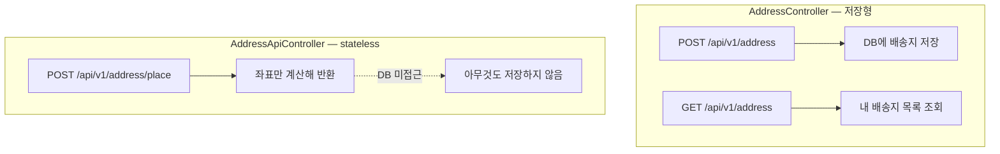
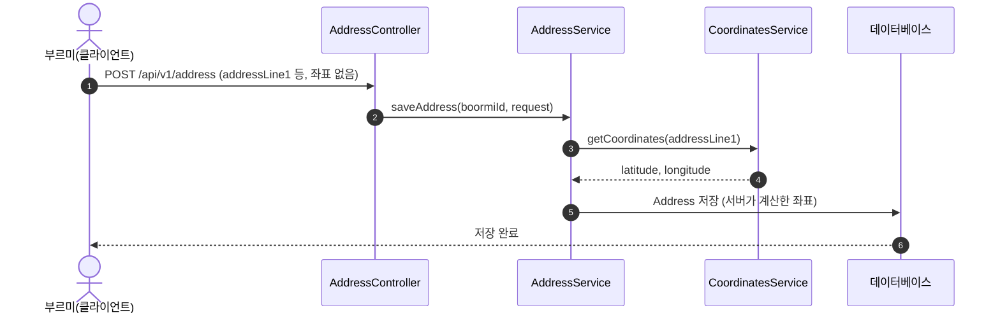
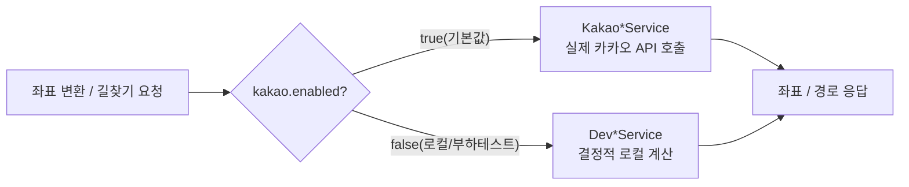

# Address 도메인

배송지(주소) 저장/조회와 도로명주소 ↔ 좌표 변환, 두 지점 간 도보 경로 계산을 담당합니다.
컨트롤러가 두 개로 나뉘어 있는데, 성격이 다릅니다.

- `AddressController` — 로그인한 부르미의 배송지를 DB에 **저장/조회**합니다.
- `AddressApiController` — 결제 전 견적 화면에서 쓰는 **상태 없는(stateless) 좌표 변환** API입니다. 아무것도 저장하지 않습니다.



## 1. 배송지 저장/조회 — `AddressController`

| Method | Path | 설명 |
|---|---|---|
| POST | `/api/v1/address` | 배송지 저장 |
| GET | `/api/v1/address` | 내 배송지 전체 조회 |

- 요청/응답 모두 `boormiId`는 요청 바디가 아니라 세션(`@LoginUser`)에서 가져옵니다. `findAll`도 `AddressRepository.findAllByBoormiId(boormiId)`로 호출자 것만 조회합니다.
    - 원래는 `AddressController` 전체가 로그인 없이 열려 있었고 `findAll()`도 전체 배송지를 반환했습니다 — 다른 사람의 배송지를 볼 수 있는 IDOR이었습니다. 커밋 `5dfb14fa`에서 로그인 필수로 바꾸고 조회를 boormiId 스코프로 좁혔습니다.
- `AddressRequestDto`는 `addressAlias`(별칭), `addressLine1`(도로명주소), `addressLine2`(상세주소) 세 필드만 받으며, 셋 다 `@NotBlank`로만 검증합니다 — 길이 제한(`@Size`)은 아직 없습니다(엔티티 컬럼은 각각 50/255/255자이지만 DTO 단에서 강제하지는 않습니다). **위도/경도는 요청에 아예 없습니다.**

### Address 엔티티

`domain/address/entity/Address.java`

```
addressId       UUID (PK)
addressAlias    String(50)  nullable  — 예: "우리집"
latitude        BigDecimal(11,8) NOT NULL
longitude       BigDecimal(11,8) NOT NULL
addressLine1    String(255) NOT NULL — 도로명주소
addressLine2    String(255) NOT NULL — 상세주소
boormiId        UUID NOT NULL
```

`AddressService.saveAddress`는 `addressLine1`(도로명주소)을 `CoordinatesService.getCoordinates(...)`에 넘겨 좌표를 계산한 뒤 엔티티를 만듭니다. **`AddressRequestDto`에는 애초에 위도/경도 필드가 없어 클라이언트가 좌표를 보낼 수단 자체가 없고, 좌표는 항상 서버가 직접 지오코딩해서 채웁니다** — 클라이언트가 조작한 좌표를 신뢰하지 않기 위한 설계입니다(원래는 `AddressRequestDto`에 위도/경도 필드가 있었는데 커밋 `32ecf0aa`에서 제거하고 서버 계산으로 바꿨습니다).



## 2. 좌표 변환(견적용) — `AddressApiController`

| Method | Path | 설명 |
|---|---|---|
| POST | `/api/v1/address/place` | 출발지/도착지 도로명주소를 좌표로 변환 |

- 요청 `AddressApiRequestDto`: `origin`, `originDetail`, `destination`, `destinationDetail`(모두 `@NotBlank` 문자열)입니다.
- 응답 `AddressCoordinatesResponseDto`: 출발지/도착지 각각의 위도·경도(`BigDecimal`, 소수 8자리)입니다.
- **DB를 전혀 건드리지 않습니다.** 클라이언트는 이 응답의 좌표를 들고 있다가 실제 주문 생성(결제) 시점에 함께 제출합니다 — 결제가 끝나기 전에는 주문 관련 row를 만들지 않기 위한 의도적인 stateless 설계입니다(원래는 `Orders`를 미리 조회/수정하는 방식이었는데 커밋 `11a5c163`에서 지금 형태로 바꿨습니다).

## 3. 카카오 API 연동(좌표 변환 · 길찾기)

두 기능 모두 인터페이스 뒤에 "카카오 실제 호출 구현체"와 "로컬용 Dev 구현체"가 분리되어 있고, `kakao.enabled`(`application.properties`, 기본값 `true`) 프로퍼티로 어떤 구현체를 쓸지 고릅니다.



### 좌표 변환(도로명주소 → 위도/경도)

`CoordinatesService.getCoordinates(roadAddress)`

- **`KakaoCoordinatesService`**(운영 기본) — 카카오 로컬 API(`GET /v2/local/search/address.json`)를 호출합니다. connect 1초/read 2초의 짧은 타임아웃을 씁니다(원래 3초/5초였는데, 카카오는 국내망이라 정상 응답이 100~200ms 수준이라는 걸 확인하고 커밋 `0050d4b4`에서 줄였습니다 — 이미 포기된 요청이 서버 자원을 오래 붙잡지 않게 하려는 목적입니다). `KAKAO_REST_API_KEY`가 없으면 앱 기동 시점에 바로 예외를 던져 실패합니다(요청마다 401을 조용히 내려주는 대신, 배포 자체를 막습니다).
- **`DevCoordinatesService`**(로컬/부하테스트용) — 실제 API를 호출하지 않고, 주소 문자열의 해시값을 강남 근처 24×28 격자에 매핑해 항상 같은 주소는 같은 좌표를 돌려줍니다(같은 주소가 견적 시점과 주문 생성 시점에 다른 좌표로 계산되면 안 되기 때문입니다). 기동 시 **경고 로그**를 남겨, 이게 운영에 실수로 켜지면 바로 눈에 띄게 해둡니다.
- 응답 검증: 카카오가 결과 없음(`documents` 빈 배열)을 반환하면 `AddressService.saveAddress`가 `EXTERNAL_SERVICE_ERROR`를 던집니다. `CoordinatesService` 인터페이스 자체는 순수 지오코딩만 하고 이 검증을 갖고 있지 않습니다 — 그래서 호출부마다 각자 빈 배열을 체크해야 하는데, 실제로 `AddressApiController.getCoordinates`(위 2번, 견적용)는 이 체크 없이 바로 `documents().getFirst()`를 호출해 결과가 없으면 `NoSuchElementException`이 그대로 새어나갈 수 있습니다.

### 길찾기(도보 경로 · 거리 · 시간)

`DirectionsService.getRoute(origin, destination)`

- **`KakaoDirectionsService`**(운영 기본) — 카카오 길찾기 API(`GET /v2/routing/walk`)를 호출해 총 거리(m)·총 시간(초)·경로 좌표를 받습니다. 응답 상태 코드가 `OK`가 아니면 카카오가 보낸 상태 문자열을 그대로 도메인 에러 코드에 매핑합니다(아래 4번).
- **`DevDirectionsService`**(로컬용) — 두 지점의 하버사인 직선거리에 우회 계수(1.3배)와 도보 속도(1.2 m/s)를 곱해 그럴듯한 거리/시간을 만듭니다. 고정값이 아니라 두 지점에 따라 실제로 달라지게 만든 이유는, 이 값이 그대로 배달비/도착예정시간 계산에 들어가기 때문입니다.

두 기능 다 `kakao.enabled`를 잘못 설정(오타 등)해도 기본은 "실제 카카오 호출"로 켜지도록 만들어져 있습니다(`matchIfMissing = true`) — 로컬/부하테스트에서 의도적으로 꺼야만 Dev 구현체가 뜹니다. 어떤 구현체가 실제로 떠 있는지는 기동 로그로만 확인할 수 있습니다.

### HTTP 클라이언트 구현 방식

`KakaoCoordinatesService`/`KakaoDirectionsService` 둘 다 같은 방식으로 카카오를 호출합니다.

- **`RestClient` + `JdkClientHttpRequestFactory`**: `RestClient` 자체는 실제 통신 방법을 모르고 `ClientHttpRequestFactory`에 위임하는 추상화입니다. connect/read 타임아웃(위 1초/2초)을 걸려면 이 팩토리를 직접 구성해야 해서, `HttpClient.newBuilder().connectTimeout(...)`으로 만든 JDK 표준 `HttpClient`를 `JdkClientHttpRequestFactory`로 감싸 썼습니다. Apache HttpClient5나 Jetty Client 같은 별도 라이브러리도 검토했지만, 카카오 API 하나만 호출하는 지금 규모에서는 의존성을 추가하지 않는 JDK 내장 `HttpClient`로 충분하다고 판단했습니다.
- **`UriComponentsBuilder`로 쿼리 파라미터 조립**: 도로명주소에 한글·특수문자가 섞여 있어도 `.queryParam(...)`이 자동으로 UTF-8 인코딩을 해줍니다 — 문자열을 직접 이어붙여 URL을 만들면 인코딩을 매번 신경 써야 하는데 그 부담을 없앱니다.
- **응답 DTO에 `@JsonIgnoreProperties(ignoreUnknown = true)`**: `CoordinatesResponseDto`/`KakaoDirectionsResponseDto` 모두 이 애노테이션이 붙어 있습니다. 카카오 응답에 우리가 정의 안 한 필드(메타 정보 등)가 섞여 와도 역직렬화가 깨지지 않게 하는 방어적 설계입니다 — 외부 API 응답은 우리가 스키마를 통제할 수 없으므로, 우리가 실제로 쓰는 필드만 명시하고 나머지는 무시하는 편이 안전합니다.

## 4. `AddressErrorCode`

카카오 길찾기 API가 돌려주는 상태 코드를 그대로 매핑한 것으로, 전부 `KakaoDirectionsService`에서만 던져집니다(HTTP 400).

| 코드 | 의미 |
|---|---|
| `SAME_POINT` | 출발지와 도착지가 동일 |
| `START_LINK_NOT_FOUND` | 출발지 주변 도로를 못 찾음 |
| `END_LINK_NOT_FOUND` | 도착지 주변 도로를 못 찾음 |
| `TOO_MANY_SEARCH_LINK` | 경로가 너무 복잡해 탐색 불가 |
| `TOO_FAR_AWAY` | 출발지·도착지가 너무 멀리 떨어짐 |
| `ROUTE_RESULT_NOT_FOUND` | 경로를 찾을 수 없음 |

카카오가 위 목록에 없는 상태를 반환하면 `AddressErrorCode`가 아니라 공통 `EXTERNAL_SERVICE_ERROR`(503)로 처리합니다. 카카오 호출 자체가 타임아웃/실패하면 `EXTERNAL_SERVICE_TIMEOUT`(504)/`EXTERNAL_SERVICE_ERROR`(503)입니다.

## 5. 다른 도메인과의 연결

- `BoormiService`는 `AddressService`가 아니라 `CoordinatesService`/`DirectionsService`를 직접 주입받아 씁니다. 견적(`/expected-value`) 계산과 실제 주문 생성 시 배달비·예상시간을 이 두 서비스로 다시 계산합니다 — **클라이언트가 보낸 요금/시간은 신뢰하지 않고 항상 서버가 같은 로직으로 재계산**합니다.
    - `BoormiService.subscribeOrder`에는 `@Transactional`을 걸지 않습니다. 카카오 API를 최대 3번 호출한 뒤에야 DB에 쓰기 때문에, 트랜잭션을 미리 열어두면 그 시간만큼 커넥션 풀을 붙잡게 됩니다(실제로 이게 원인이 된 장애가 있었습니다 — 커밋 `0050d4b4` 참고). DB 반영은 별도 트랜잭션(`OrderPlacementService.place`)으로 분리했습니다.
- `DeliveryService`는 드리미의 첫 위치 수신 시 "드리미 → 픽업지" 경로를 계산하는 데 `DirectionsService`만 씁니다.

## 6. 프론트엔드 연동(참고)

- [AddressSheet.tsx](frontend/src/pages/request-create/ui/AddressSheet.tsx) — 배송지 선택 바텀시트입니다. 도로명주소 검색은 카카오가 아니라 다음(Daum) 우편번호 위젯을 쓰고, 저장된 배송지 조회/저장은 위 `AddressController` API를 그대로 호출합니다. 프론트에는 좌표가 전혀 노출되지 않습니다.
- [useCurrentAddress.ts](frontend/src/shared/lib/geo/useCurrentAddress.ts) — "현재 위치" 표시용입니다. 이건 백엔드 API가 아니라 브라우저 Geolocation + 카카오맵 JS SDK로 클라이언트에서 직접 역지오코딩합니다. 별개의 경로입니다.
