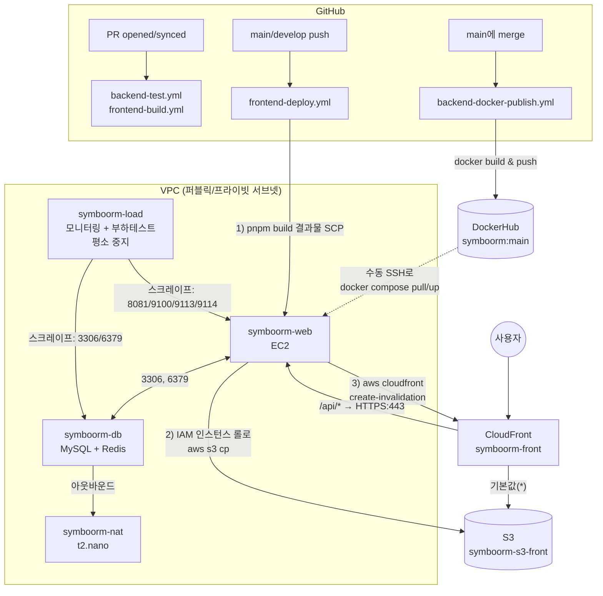
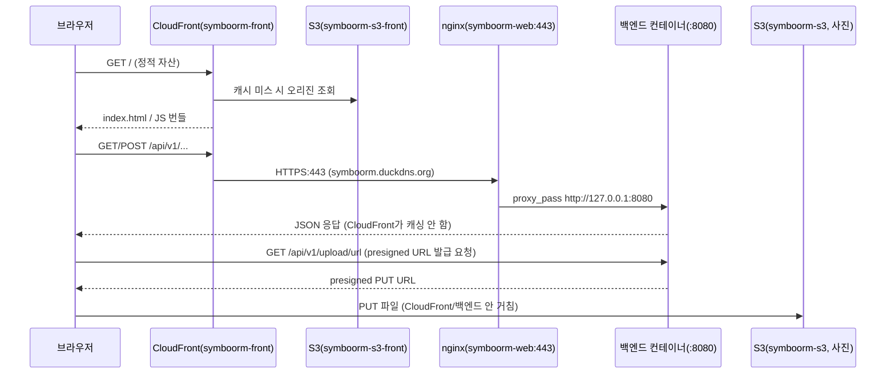

# CI/CD & AWS 인프라

면접 대비용으로 실제 배포 파이프라인과 AWS 구성을 정리한 문서. `.github/workflows/`, `backend/docker-compose.yml`, 각 인스턴스에 SSH로 직접 접속해 확인한 내용을 근거로 작성했다.

## 0. 먼저 알아야 할 개념

아래 절들에서 당연하게 쓰는 용어들을 먼저 정리한다. 이미 아는 개념은 건너뛰어도 됨.

### CI/CD

- **CI(Continuous Integration)**: 코드를 merge하기 전에 자동으로 빌드·테스트를 돌려서 "이 변경이 기존 걸 깨지 않는다"를 검증하는 것. 이 프로젝트에서는 `backend-test.yml`, `frontend-build.yml`이 이 역할 — PR을 열 때마다 자동 실행되고, 실패하면 merge를 막는 근거가 된다.
- **CD(Continuous Delivery/Deployment)**: 검증된 코드를 실제 서버에 반영하는 것. "Delivery"는 배포 가능한 상태까지만(사람이 최종 버튼을 누름), "Deployment"는 그 반영까지 완전 자동화하는 것을 구분해서 부르기도 한다. 이 프로젝트는 **딱 그 경계에 걸쳐 있다** — 이미지를 만들어서 레지스트리에 올리는 것까지는 자동(Delivery급)이고, 서버에 실제로 새 버전을 띄우는 건 사람이 SSH로 수동 실행(Deployment 자동화는 안 됨). 면접에서 "CD까지 되어 있나요?"라고 물으면 이 구분으로 정확히 답하면 된다.

### Docker 이미지와 레지스트리

- 백엔드를 "빌드된 jar 파일 그대로"가 아니라 **Docker 이미지**로 배포하는 이유: 실행 환경(JRE 버전, OS)을 이미지 안에 고정해서 "내 로컬에선 되는데 서버에선 안 됨" 문제를 없앤다. `backend/Dockerfile`이 `eclipse-temurin:21-jre` 베이스에 jar 하나만 얹는 얇은 이미지다.
- **레지스트리(DockerHub)**: 이미지를 저장/배포하는 저장소. CI가 이미지를 빌드해서 여기 push하고, 배포 서버는 여기서 pull한다 — CI 서버와 배포 서버가 직접 파일을 주고받지 않고 레지스트리를 매개로 분리되는 게 핵심 (CI가 만든 결과물을 아무 때나 아무 서버에서나 pull해서 쓸 수 있음).
- **이미지 태그 전략**: `main`(항상 최신)과 `main-<PR번호>`(그 시점 고정본) 두 개를 같이 붙이는 이유는 롤백 때문 — `main` 태그는 계속 최신을 가리키므로 "지금 몇 번째 커밋이 떠 있는지"를 알 수 없는데, PR번호 태그가 있으면 `IMAGE_TAG=main-123 docker compose up -d`처럼 특정 버전으로 즉시 되돌릴 수 있다.

### 리버스 프록시 / TLS 종료 (nginx)

- **리버스 프록시**: 클라이언트 요청을 대신 받아서 뒤에 있는 실제 서버(여기선 `127.0.0.1:8080` 백엔드 컨테이너)로 넘겨주는 중간 서버. nginx가 이 역할.
- **TLS 종료(TLS termination)**: HTTPS 요청은 암호화를 풀어야(복호화) 실제 요청 내용을 볼 수 있는데, 이 복호화 작업을 nginx가 대신 맡고 그 뒤 백엔드와는 평문 HTTP(`127.0.0.1:8080`)로 통신하는 구조. 인증서(`ssl_certificate`)는 nginx만 갖고 있으면 되고, 스프링 애플리케이션은 TLS를 신경 쓸 필요가 없어진다.
- **certbot / Let's Encrypt**: 무료로 TLS 인증서를 발급·자동갱신해주는 도구. `symboorm.duckdns.org` 도메인에 대해 발급받아 nginx 설정에 꽂아둔 상태(3.2절).
- 이 프로젝트에서 nginx가 필요했던 구체적 이유: CloudFront의 `/api/*` 오리진이 **HTTPS만** 허용하도록 설정돼 있어서(8절), 그 앞단에 유효한 인증서로 응답하는 서버가 있어야 했다.

### CDN과 CloudFront

- **CDN(Content Delivery Network)**: 전 세계 엣지 서버에 콘텐츠를 캐싱해두고, 사용자와 가장 가까운 엣지에서 응답해 속도를 높이는 서비스. CloudFront가 AWS의 CDN 서비스.
- **오리진(origin)**: CDN이 캐시 미스일 때 실제로 데이터를 가져오는 원본 서버. 이 프로젝트는 오리진이 두 개다 — 정적 파일용(S3), API용(nginx/백엔드). "커스텀 오리진"은 S3/ALB 같은 AWS 관리형이 아니라 임의의 도메인(여기선 `symboorm.duckdns.org`)을 오리진으로 쓴다는 뜻.
- **동작(behavior)/경로 패턴**: 요청 경로별로 어느 오리진으로 보낼지, 캐싱을 할지 말지를 정하는 규칙. `/api/*`는 캐싱 비활성(요청마다 항상 최신 응답 필요), 나머지(`*`)는 캐싱 최적화(정적 파일이라 오래 캐싱해도 됨).
- **캐시 무효화(invalidation)**: 새로 배포했는데 CDN이 옛날 파일을 계속 캐시해서 보여주는 걸 막기 위해, 배포 직후 "이 경로의 캐시를 버려라"고 CloudFront에 명령하는 것(`aws cloudfront create-invalidation`). 이 프로젝트는 파일명 자체에 콘텐츠 해시가 붙는 파일(`assets/*`)은 캐시를 오래 둬도 무효화가 필요 없고(파일명이 바뀌므로), `index.html`처럼 해시가 없는 파일만 무효화 대상이 아니라 애초에 `no-cache`로 캐싱 자체를 안 시킨다.
- **왜 S3를 CloudFront 없이 그냥 정적 웹호스팅으로 안 쓰는가**: S3 정적 웹호스팅은 버킷을 퍼블릭으로 열어야 하는데, 이 프로젝트는 버킷을 비공개로 두고 CloudFront 서비스 프린시펄에게만 `GetObject`를 허용한다(7절 버킷 정책의 `AllowCloudFrontServicePrincipal`) — 이러면 S3에 직접 URL로 접근이 안 되고 반드시 CloudFront를 거쳐야 해서, HTTPS 강제·캐싱·접근 통제를 CloudFront 한 곳에서 관리할 수 있다.

### IAM: 역할(Role) vs 사용자(User), 인스턴스 프로파일

- **IAM User + Access Key**: 발급받은 키를 어딘가(CI 러너, 로컬 등)에 "심어두고" 쓰는 방식. 키가 코드/설정 파일에 남거나 유출되면 그대로 도용당한다.
- **IAM Role(+인스턴스 프로파일)**: 키를 심어두지 않고, "이 EC2 인스턴스가 곧 이 권한이다"라고 AWS가 임시 자격증명을 자동으로 발급/교체해주는 방식. `symboorm-web`에 붙은 `symboorm-front-deploy`, `symboorm-s3-upload-rolepolicy`가 이거다. 이 프로젝트가 "GitHub Actions 러너에는 자격증명을 두지 않고 EC2를 거친다"고 설계한 이유가 바로 이 개념 — 러너는 권한이 없고, 권한은 오직 EC2 인스턴스 롤에만 있다.
- **최소 권한 원칙**: 정책을 보면 `s3:PutObject`를 버킷 전체가 아니라 `symboorm-s3-front/*`, `symboorm-s3/uploads/*`처럼 **경로까지 좁혀서** 부여한다 — 이 인스턴스가 뚫려도 피해 범위를 최소화하려는 설계.

### Presigned URL

- 서버가 파일을 대신 받아서 S3에 올려주는 대신, "이 URL로 n분 안에 딱 이 파일 하나만 업로드해도 좋다"는 **서명된 임시 URL**을 클라이언트에게 발급해주고, 클라이언트가 S3에 직접 PUT하게 하는 방식. 서버는 파일 바이트를 안 거치므로 서버 대역폭·메모리 부담이 없다.
- 이 URL에 서명하려면 서명 주체(백엔드가 도는 `symboorm-web`의 IAM 롤)가 해당 S3 액션 권한을 갖고 있어야 한다 — 실제로 파일이 오가는 주체는 클라이언트↔S3지만, "서명할 자격"은 서버 쪽 권한으로 검증된다는 점이 헷갈리기 쉬운 부분.

### 네트워크: VPC, 서브넷, 보안그룹, NAT

- **VPC**: AWS 안에 격리된 나만의 가상 네트워크. 이 프로젝트는 VPC 하나 안에서 전부 돈다.
- **퍼블릭 서브넷 vs 프라이빗 서브넷**: 인터넷 게이트웨이(IGW)로 나가는 라우팅이 있으면 퍼블릭(공인 IP를 받을 수 있음), 없으면 프라이빗(외부에서 직접 접근 불가). `symboorm-db`가 프라이빗에 있는 이유는 DB를 인터넷에 절대 직접 노출하지 않기 위해서.
- **보안그룹(Security Group)**: 인스턴스 단위로 붙는 방화벽. "어느 포트를, 어디서 오는 트래픽만 허용할지"를 정의. 이 프로젝트에서 액츄에이터(8081)를 인터넷 전체가 아니라 모니터링 인스턴스의 보안그룹으로만 허용한 게 대표적 활용 예(5절).
- **NAT(Network Address Translation)**: 프라이빗 서브넷 인스턴스는 공인 IP가 없어서 인터넷으로 직접 못 나가는데(예: Docker 이미지 pull), NAT를 거치면 나갈 수는 있게 해준다(단, 밖에서 안으로 들어오는 건 여전히 불가 — 편도). AWS 관리형인 **NAT Gateway**는 시간당 요금 + 트래픽 처리 요금이 붙는 유료 서비스라, 이 프로젝트는 대신 **t2.nano 인스턴스에 NAT 기능을 직접 구성**해서 비용을 줄였다(5절) — 관리형 서비스 대신 직접 구성해서 비용을 낮추는 전형적인 트레이드오프 사례로 설명하면 좋다.

### 모니터링: Pull 기반 수집

- Prometheus는 자기가 각 대상(백엔드 액츄에이터, node_exporter 등)에게 **주기적으로 찾아가서(scrape/pull)** 지표를 긁어온다 — 애플리케이션이 지표를 어딘가로 쏘는(push) 방식이 아니다. 그래서 "누구를 긁을지" 목록이 `prometheus.yml`의 `scrape_configs`다.
- **exporter**: Prometheus가 이해하는 포맷(`/metrics`)으로 지표를 변환해서 노출해주는 작은 프록시. MySQL/Redis 자체는 Prometheus 포맷을 모르므로 `mysqld_exporter`, `redis_exporter`가 그 사이에서 통역 역할을 한다. `node_exporter`는 OS/커널 지표(CPU, 메모리, 디스크)를 노출한다.
- **Grafana**: Prometheus에 쌓인 시계열 데이터를 대시보드로 시각화하는 도구. Prometheus는 저장·쿼리(PromQL)만 하고, 그래프를 그리는 건 Grafana 몫으로 역할이 나뉜다.
- **Alertmanager**: Prometheus가 정의한 알림 규칙(`alert-rules.yml`)이 조건을 만족하면 그 알림을 실제로 어디(Slack, 이메일 등)로 보낼지 라우팅하는 별도 컴포넌트 — Prometheus 자체는 "조건 만족 여부 판단"까지만 하고 발송은 Alertmanager가 담당.

### JVM 메모리 구조 (docker-compose.yml JVM 옵션 이해용)

- **힙(Heap, `-Xmx`)**: 객체 인스턴스가 실제로 저장되는 공간. GC가 관리하는 영역.
- **메타스페이스(Metaspace, `-XX:MaxMetaspaceSize`)**: 클래스 메타데이터(클래스 구조 정보)가 저장되는 공간. 힙과 별도라서, 라이브러리가 많아 로드되는 클래스 수가 많으면(이 프로젝트처럼 springdoc + AWS SDK + Hibernate 조합) 이 값을 넉넉히 안 잡으면 OOM이 난다.
- **스레드 스택(`-Xss`)**: 스레드 하나가 함수 호출 정보를 쌓는 공간. 스레드 수 × 스택 크기가 그대로 메모리로 잡히므로, 톰캣 워커 스레드 수(`server.tomcat.threads.max`)를 줄이는 것과 스택 크기를 줄이는 게 세트로 다뤄진다.
- 이 넷(힙+메타스페이스+코드캐시+스택×스레드수)을 다 더한 게 컨테이너 `mem_limit`을 넘으면 컨테이너가 OOM-killed 된다 — t3.micro처럼 물리 메모리가 작을수록 이 산수가 중요해진다.

---

## 1. 전체 그림



## 2. GitHub Actions 워크플로우

저장소에는 워크플로우 5개가 있다.

| 파일 | 트리거 | 하는 일 |
|---|---|---|
| `backend-test.yml` | `backend/**` 변경된 PR opened/synchronize/reopened | `./gradlew test -PexcludeTags=integration` |
| `backend-docker-publish.yml` | `backend/**` 변경된 PR이 **main으로 merge**됨 | bootJar 빌드(테스트 제외) → Docker 이미지 빌드 → DockerHub push |
| `frontend-build.yml` | `frontend/**` 변경된 PR opened/synchronize/reopened | `pnpm lint && pnpm build` (검증만, 배포 아님) |
| `frontend-deploy.yml` | main/develop에 push, 또는 수동(`workflow_dispatch`) | 빌드 → EC2로 SCP → EC2에서 S3 업로드 + CloudFront 무효화 |
| `protect_branch.yml` | main 대상 모든 PR | source 브랜치가 `develop`이 아니면 실패시킴 (main 직접 PR 방지) |

### 2.1 backend-docker-publish.yml — 여기서 CD가 "절반만" 자동화됨

```yaml
tags: |
  ${{ secrets.DOCKERHUB_USERNAME }}/symboorm:${{ github.base_ref }}
  ${{ secrets.DOCKERHUB_USERNAME }}/symboorm:${{ github.base_ref }}-${{ github.event.pull_request.number }}
```

- `main` 태그(최신)와 `main-<PR번호>` 태그(롤백용 특정 버전) 두 개를 같이 push한다.
- **여기서 파이프라인이 끝난다.** EC2에서 새 이미지를 pull하고 컨테이너를 재기동하는 단계는 워크플로우에 없다 — **`symboorm-web`에 직접 SSH 접속해서 `docker compose pull && docker compose up -d`를 수동 실행**한다. 즉 "빌드/푸시는 CI, 실제 배포는 수동"인 구조.

### 2.2 frontend-deploy.yml — GitHub Actions 러너가 S3에 직접 못 올리는 이유

```yaml
# GitHub Actions 러너 IP에서는 S3 접근이 차단되어 있으므로, 빌드 산출물을 EC2로 보낸 뒤
# EC2에서 IAM 인스턴스 롤로 S3에 업로드한다. (러너에는 AWS 자격증명을 두지 않는다)
```

흐름:
1. `pnpm build` (빌드 시점에 `VITE_API_BASE_URL`, `VITE_KAKAO_MAP_KEY`를 secrets에서 주입해 번들에 인라인)
2. `appleboy/scp-action`으로 `frontend/dist`를 `symboorm-web` 인스턴스의 `/tmp/frontend-deploy`로 전송
3. `appleboy/ssh-action`으로 같은 인스턴스에 SSH 접속해서 스크립트 실행:
   - 컨텐츠 해시 붙은 정적 자산(`assets/*` 등)은 `--cache-control public,max-age=31536000,immutable`로 S3 업로드 (1년 캐시, 파일명 자체가 해시라 충돌 없음)
   - `index.html`, `sw.js`, `registerSW.js`, `manifest.webmanifest`는 `no-cache,no-store,must-revalidate` — 해시 없는 파일이라 오래 캐시하면 PWA 업데이트가 전달 안 됨
   - `aws s3 cp --recursive` 사용 (조직 SCP 정책이 `s3:ListBucket`을 명시적으로 거부해서 `s3 sync`는 못 씀 → `--delete` 옵션도 못 씀 → 과거 에셋이 버킷에 남지만 해시 파일명이라 충돌은 없음)
   - `aws cloudfront create-invalidation --paths "/*"`

즉, **왜 EC2를 거치는가**가 핵심 포인트: GitHub Actions 러너에는 AWS 자격증명을 아예 두지 않고, S3/CloudFront 권한은 EC2 인스턴스 프로파일(`symboorm-front-deploy` 롤)에만 부여했다. 러너가 직접 못 올리는 것도 조직 정책(러너 IP 차단)이라 이 우회가 필요했다.

### 2.3 GitHub Secrets (이름)

| Secret | 용도 |
|---|---|
| `DOCKERHUB_USERNAME`, `DOCKERHUB_TOKEN` | 백엔드 이미지 push |
| `VITE_API_BASE_URL`, `VITE_KAKAO_MAP_KEY` | 프론트 빌드 시 번들에 인라인 |
| `EC2_HOST`, `EC2_USER`, `EC2_SSH_KEY` | `symboorm-web` SSH 접속 (백엔드 인스턴스와 동일) |
| `S3_BUCKET`, `CLOUDFRONT_DISTRIBUTION_ID` | 프론트 배포 대상 |

## 3. 백엔드 배포 (EC2)

### 3.1 `backend/docker-compose.yml` 핵심

- 이미지: `seoki/symboorm:${IMAGE_TAG:-main}` (DockerHub에서 pull, 이미지 안에 시크릿 없이 jar만 포함 — `.env`는 배포 서버에서 런타임에 `env_file`로 주입)
- 포트: `8080`(API, 공개) / `8081`(액츄에이터, 모니터링 SG에서만 허용 — EC2는 IGW가 공인 IP를 NAT하므로 바인딩 주소로 못 막고 **보안그룹이 유일한 방어선**)
- 메모리 예산: 인스턴스가 t3.micro(vCPU 2, 물리 RAM 908MB)라 `mem_limit: 800m`, `memswap_limit: 800m`으로 스왑을 봉쇄(GC가 힙을 랜덤 액세스로 훑는데 스왑을 쓰면 최악의 워크로드가 됨)
  - `-Xms192m -Xmx192m`: 실사용 133MiB 기준 여유
  - `-XX:MaxMetaspaceSize=256m`: springdoc-openapi + AWS SDK v2 + BouncyCastle + Hibernate 조합이 클래스 3만 개(~150MB)라 예전 160m 상한에서 Metaspace OOM 겪음(2026-08-13 부하테스트)
  - `-Xss512k`: 스레드 246개 × 기본 1MB 스택 = 246MB가 예산에서 가장 큰 덩어리라 축소 (`application.properties`의 `server.tomcat.threads.max=100`과 세트)
  - `MALLOC_ARENA_MAX=2`: glibc가 스레드마다 arena를 파서 RSS가 부푸는 것 방지

### 3.2 nginx — 저장소에는 없고 EC2 호스트에 직접 설치됨

`symboorm-web` 인스턴스에 **컨테이너가 아니라 OS에 직접** nginx가 떠 있다 (`backend/Dockerfile`은 jar만 담아서 nginx가 없음).

```
listen 443 ssl;   # certbot이 추가
ssl_certificate     /etc/letsencrypt/live/symboorm.duckdns.org/fullchain.pem
ssl_certificate_key /etc/letsencrypt/live/symboorm.duckdns.org/privkey.pem
listen 80;
server_name symboorm.duckdns.org;
proxy_pass http://127.0.0.1:8080;   # 둘 다 백엔드 컨테이너로
```

- **역할**: Let's Encrypt(certbot) 인증서로 TLS 종료 → `127.0.0.1:8080`(백엔드 컨테이너)으로 리버스 프록시
- `worker_connections 2048` (기본 768에서 상향): 2026-08-18 부하테스트에서 SSE 동시 연결 701개 × 슬롯 2개(클라이언트+업스트림) = 1402슬롯이 필요했는데 768×2 워커로 부족해 `error.log`에 경고가 찍혔음 → 2048×2로 여유 확보
- `127.0.0.1:8083`에 별도 리스너가 하나 더 있음 — `stub_status`용으로 추정(nginx-prometheus-exporter가 로컬에서만 긁도록 localhost 바인딩). 정확한 용도는 미확인.
- **왜 필요한가**: CloudFront의 `/api/*` 오리진이 `symboorm.duckdns.org:443`(HTTPS)이기 때문에 이 도메인에 유효한 TLS 인증서가 필요하고, 백엔드 컨테이너 자체는 TLS를 안 하므로 nginx가 그 앞단을 맡는다.
- **왜 Spring Boot(Tomcat)가 직접 HTTPS를 안 하고 nginx가 하는가**: 기술적으로는 내장 Tomcat도 키스토어로 직접 443을 물 수 있지만, 아래 발급/갱신 자동화 도구가 nginx를 전제로 만들어져 있어 nginx를 쓰는 게 훨씬 간단하다.

**실제로 어떻게 발급/갱신되는지 (SSH로 직접 확인한 내용)**

```bash
$ cat /etc/letsencrypt/renewal/symboorm.duckdns.org.conf
authenticator = nginx
installer = nginx
key_type = ecdsa

$ snap list certbot
Name     Version  Rev   Tracking       Publisher     Notes
certbot  5.8.0    5893  latest/stable  certbot-eff✓  classic

$ systemctl list-timers | grep certbot
snap.certbot.renew.timer   ...   snap.certbot.renew.service
```

- certbot을 **snap**으로 설치했다(`apt install certbot`이 아니라 `snap install --classic certbot`). `authenticator = nginx` + `installer = nginx`는 `certbot --nginx -d symboorm.duckdns.org`를 실행했을 때 나오는 조합 그대로다 — nginx 플러그인이 도메인 소유 검증(HTTP-01 챌린지: 80번 포트로 Let's Encrypt CA가 접근해서 확인)과 nginx 설정 수정(443 블록 추가)을 한 번에 처리한다.
- 갱신은 cron이 아니라 **snap이 자동으로 등록하는 systemd timer**(`snap.certbot.renew.timer`)가 하루 두 번 돌면서 만료 30일 이내인 인증서만 갱신하고 nginx를 reload한다. `/etc/cron.d/certbot`은 존재하지 않는다(snap 설치라 필요 없음) — apt로 설치했다면 대신 cron으로 관리됐을 부분.
- 인증서는 ECDSA 키 타입, 발급자는 Let's Encrypt(`acme-v02.api.letsencrypt.org`).

**TLS가 실제로 몇 번 걸리는지**: 클라이언트가 nginx에 바로 오는 게 아니라 CloudFront를 한 번 거친다(10절 시퀀스 다이어그램 참고).

```
클라이언트 --[HTTPS]--> CloudFront --[HTTPS, "HTTPS만" 오리진 프로토콜]--> nginx:443 --[HTTP, 127.0.0.1:8080]--> 백엔드 컨테이너
```

CloudFront가 오리진(`symboorm.duckdns.org`)에 붙을 때도 HTTPS를 쓰도록 오리진 프로토콜을 "HTTPS만"으로 지정해뒀기 때문에, nginx 입장에서 실제 클라이언트는 브라우저가 아니라 CloudFront다. nginx→백엔드 구간만 평문인데, 이 구간은 같은 호스트 안의 loopback(127.0.0.1)이라 네트워크에 노출되지 않는다.

### 3.3 실제 배포 절차 (수동)

```bash
# symboorm-web 에서
cd ~/symboorm/backend
docker compose pull   # DockerHub 최신 main 이미지
docker compose up -d
```

CI가 이미지까지는 자동으로 올려두지만, **운영 서버에 실제로 반영하는 건 SSH 접속 후 수동 명령**이다. Watchtower 같은 자동 풀러는 없음.

## 4. 데이터 계층 — `symboorm-db` 하나에 MySQL + Redis 동거

프라이빗 서브넷 인스턴스 하나(t3.micro)에 두 스택이 같이 떠 있다.

- **MySQL**: EC2에 직접 설치(RDS 아님). `backend/sql/sym-boorm-ddl.sql`로 DDL 관리, 테이블명 대문자(`lower_case_table_names=0`)
- **Redis**: `redis/docker-compose.yml`, `network_mode: host`로 6379 직결. `--maxmemory 64mb --maxmemory-policy noeviction --appendonly no` — 로그인 대기열(수명 2분짜리 휘발성 데이터)이 용도라 디스크 저장 불필요, evict보다 쓰기 실패가 낫다는 판단(대기열 티켓이 조용히 사라지는 것 방지)

보안그룹(`symboorm-sg-db`) 인바운드로 봤을 때 이 인스턴스에 접근 가능한 건 `symboorm-web`(3306, 6379, SSH)과 `symboorm-load`(3306, 6379, 9100 — 모니터링/부하테스트용)뿐이고 인터넷에는 안 열려 있다.

## 5. 네트워크 구성

VPC 하나 안에 퍼블릭/프라이빗 서브넷이 나뉘어 있다.

| 인스턴스 | 타입 | 역할 | 서브넷 |
|---|---|---|---|
| `symboorm-web` | t3.micro | 백엔드(Docker) + nginx(TLS 종료) + 프론트 배포 중계 | 퍼블릭 |
| `symboorm-db` | t3.micro | MySQL + Redis | 프라이빗 (공인 IP 없음) |
| `symboorm-nat` | t2.nano | 자체 구축 NAT 인스턴스 — 프라이빗 서브넷(`10.0.0.0/16`)의 아웃바운드 인터넷 경로 | 퍼블릭 |
| `symboorm-load` | t3.micro | 모니터링(Prometheus/Grafana/Alertmanager/exporter들) + 부하테스트. 프로젝트 기간 종료 후 평소 중지 | 퍼블릭(추정) |

NAT Gateway(관리형)가 아니라 **t2.nano에 직접 NAT를 구성**해서 비용을 아낀 것으로 보인다. `symboorm-db`처럼 공인 IP가 없는 인스턴스가 외부(Docker Hub 이미지 pull 등)로 나갈 때 이 인스턴스를 거친다.

보안그룹 인바운드 요약:

| 보안그룹 | 열린 포트 | 소스 |
|---|---|---|
| `symboorm-sg-web` | 80, 443, 8080 | `0.0.0.0/0` |
| | 22 | `0.0.0.0/0` |
| | 8081, 9100, 9113, 9114 | `symboorm-sg-load`만 |
| `symboorm-sg-db` | 3306, 6379 | `symboorm-sg-web`, `symboorm-sg-load` |
| | 22 | `symboorm-sg-web` |
| | 9100 | `symboorm-sg-load` |
| `symboorm-sg-nat` | 22 | `0.0.0.0/0` |
| | 전체 트래픽 | `10.0.0.0/16` (프라이빗 서브넷 CIDR) |
| `symboorm-sg-load` | 22, 3000(Grafana) | `0.0.0.0/0` |

8081(액츄에이터)이 `0.0.0.0/0`이 아니라 모니터링 인스턴스 보안그룹으로만 제한된 게 포인트 — EC2는 공인 IP를 IGW가 NAT하기 때문에 애플리케이션 바인딩 주소로는 외부 접근을 못 막고, 보안그룹이 유일한 방어선이라는 걸 코드 주석에서도 강조하고 있다.

## 6. 모니터링 — 저장소보다 실제 배포가 더 넓다

`monitoring/docker-compose.yml`(git 커밋본)은 Prometheus + Grafana 2개 컨테이너만 정의하지만, `symboorm-load`에 실제로 떠 있는 건 5개다.

```
symboorm-grafana          (3000, 공개)
symboorm-prometheus       (9090, localhost만)
symboorm-alertmanager     (9093, localhost만)
symboorm-mysqld-exporter  (9104, 내부 네트워크)
symboorm-redis-exporter   (9121, 내부 네트워크)
```

`alert-rules.yml`, `node-exporter/`, `nginx-exporter/` 폴더는 git에 없다 — **배포 서버에 직접 구성해서 git으로 관리 안 되는 부분**. 실제 배포 서버의 `prometheus.yml`도 커밋된 버전과 다르다(커밋본은 `10.0.1.43:8001` 같은 플레이스홀더, 실제는 아래처럼 5개 job으로 확장돼 있음).

```yaml
scrape_configs:
  - job_name: symboorm-backend   # 10.0.1.43:8081 (백엔드 액츄에이터)
  - job_name: node               # 10.0.1.43:9100 (백엔드 인스턴스 호스트 지표 — node_exporter)
  - job_name: mysql              # mysqld-exporter:9104 (db 인스턴스 MySQL을 원격으로 긁음)
  - job_name: redis              # redis-exporter:9121  (db 인스턴스 Redis를 원격으로 긁음)
  - job_name: prometheus         # localhost:9090 (자기 자신)
  - job_name: nginx              # 10.0.1.43:9113 (nginx stub_status)
  - job_name: nginx-log          # 10.0.1.43:9114 (nginx 액세스로그 파서 — 상태코드/업스트림 응답시간)
```

node_exporter는 커널을 직접 읽어야 해서 원격 수집이 불가능하므로 각 인스턴스(`symboorm-web`, `symboorm-db`)에 직접 띄우고, mysqld-exporter/redis-exporter는 반대로 `symboorm-load` 안에서 떠서 db 인스턴스를 원격으로 긁는다(왜 배치가 다른지 물어보면 이 이유로 답하면 됨).

## 7. S3 버킷 두 개

| 버킷 | 용도 | 정책/설정 |
|---|---|---|
| `symboorm-s3` | 사진 업로드 (presigned URL) | CloudFront 서비스 프린시펄에게 `GetObject` 허용(버킷 정책의 `SourceArn`이 CloudFront 배포를 가리킴, 단 그 배포 ID `E1PSRDMH7YYGAR`는 현재 CloudFront 목록에 실존하지 않음 — 죽은 설정으로 보임). 실제로는 presigned URL만 쓰므로 CloudFront 경유 없이 클라이언트가 S3에 직접 PUT/GET. CORS로 `localhost:5173`, `localhost:8080`, CloudFront 도메인 등에서 PUT/GET 허용 |
| `symboorm-s3-front` | 프론트 정적 파일(`dist/`) | CloudFront(`E2A8PE8JHWO42L` = `symboorm-front`)에게만 `GetObject` 허용, 버킷 자체는 퍼블릭 아님. CORS 없음(CloudFront가 유일한 진입점이라 불필요) |

IAM 정책은 두 개로 나뉘어 `symboorm-web`(프론트 배포를 중계하는 인스턴스이자 presigned URL을 서명하는 백엔드가 도는 인스턴스)의 인스턴스 프로파일에 붙어 있다.

- `symboorm-front-deploy`: `s3:PutObject`(`symboorm-s3-front/*`) + `cloudfront:CreateInvalidation`
- `symboorm-s3-upload-rolepolicy`: `s3:PutObject`/`s3:GetObject`(`symboorm-s3/uploads/*`) — 백엔드가 presigned URL을 **서명**하려면 서명 주체(이 인스턴스 롤)에게 해당 액션 권한이 있어야 하기 때문에 필요

## 8. CloudFront (`symboorm-front`, `E2A8PE8JHWO42L`)

- 대체 도메인(CNAME) 없음 → 커스텀 ACM 인증서도 없음. 프론트는 CloudFront 기본 도메인(`https://d3cev4xst074qp.cloudfront.net`)으로만 서비스됨
- 원본 3개가 등록돼 있지만 동작(behavior)은 2개뿐:
  - `/api/*` → `symboorm.duckdns.org`(HTTPS:443, 커스텀 오리진) — 캐싱 비활성(`Managed-CachingDisabled`), 뷰어 헤더 전체 전달(`Managed-AllViewer`)
  - 기본값(`*`) → `symboorm-s3-front` (S3), HTTP→HTTPS 리다이렉트, `Managed-CachingOptimized`
  - `symboorm-s3`(사진 버킷)는 원본에 등록만 돼 있고 대응하는 동작이 없음 — presigned URL 방식이라 CloudFront를 안 거치므로 실질적으로 미사용 원본

이 덕분에 프론트는 `VITE_API_BASE_URL`을 비워두면 `/api/...` 상대경로로 호출하고, CloudFront가 같은 오리진인 것처럼 `/api/*`만 백엔드로 프록시해준다 — **프론트·백엔드가 사실상 동일 출처**로 동작해서 CORS 이슈를 CloudFront 레벨에서 회피하는 구조.

## 9. DNS — Route53 없음, DuckDNS + certbot

Route53을 안 쓰고 무료 동적 DNS인 **DuckDNS**로 `symboorm.duckdns.org`를 `symboorm-web`의 공인 IP에 연결했다. 이 도메인에 certbot(snap 설치, `--nginx` 플러그인)으로 발급받은 Let's Encrypt 인증서를 nginx가 물고 있고, 갱신은 `snap.certbot.renew.timer`가 자동으로 처리한다(3.2 참고, SSH로 직접 확인 완료). 인스턴스에 Elastic IP를 안 붙였다면 재부팅 시 IP가 바뀌므로 DuckDNS 쪽 A레코드 갱신이 필요한데, 이 부분(자동 갱신 스크립트 유무)은 아직 미확인.

## 10. 요청 흐름 정리



## 11. 정리 — 레거시/불확실 항목

면접에서 "이거 왜 이렇게 돼있어요?"에 대비해 명확히 구분해둘 것들.

| 항목 | 상태 |
|---|---|
| `symboorm-s3` 버킷 정책의 CloudFront 배포 `E1PSRDMH7YYGAR` | CloudFront 목록에 없는 배포 ID — 죽은 설정. presigned URL만 쓰므로 실제로는 CloudFront 경유 안 함 |
| 저장소 커밋본 `monitoring/prometheus.yml`(타깃 `10.0.1.43:8001`) | 실제 배포 서버 파일과 다름 — 배포 서버 것이 진짜(5개 job, alertmanager 포함) |
| nginx `127.0.0.1:8083` 리스너 | stub_status용으로 추정되나 미확인 |
| DuckDNS 자동 갱신 여부 | 미확인 (crontab 확인 필요) |
| `symboorm-load`가 퍼블릭 서브넷인지 | 보안그룹이 `0.0.0.0/0`을 허용하는 걸 보면 그런 것으로 보이나, 인스턴스 상세의 서브넷 ID로 직접 확인은 안 함 |

## 12. 예상 질문 키워드

- **왜 백엔드 CD가 이미지 push까지만 자동이고 EC2 반영은 수동인가?** — 배포 시점을 팀이 직접 통제하고 싶었을 가능성, 혹은 자동 배포용 워크플로우를 아직 안 만든 것. (실제 팀 의사결정 이유는 본인이 기억해서 채워야 함)
- **GitHub Actions 러너가 왜 S3에 직접 못 올리나?** — 조직 정책상 러너 IP가 S3 접근 차단됨 + 애초에 러너에 AWS 자격증명을 두지 않는 게 보안상 낫다는 판단 → EC2 인스턴스 롤을 경유
- **nginx가 왜 필요한가?** — CloudFront `/api/*` 오리진이 HTTPS 443을 요구하는데 백엔드 컨테이너 자체는 TLS를 안 하므로, TLS 종료 담당이 별도로 필요
- **MySQL을 왜 RDS 대신 EC2에?** — 비용(RDS 대비 EC2 직접 운용이 저렴), 프로젝트 규모상 관리형 DB까지는 불필요하다고 판단했을 가능성
- **왜 NAT Gateway 대신 t2.nano NAT 인스턴스?** — NAT Gateway는 시간당 과금 + 데이터 처리 요금이 있어 사이드 프로젝트엔 비쌈. t2.nano는 프리티어/저비용
- **Redis maxmemory-policy를 왜 noeviction으로?** — 로그인 대기열 티켓이 evict되면 대기자가 "조용히" 사라져 원인 파악이 어려움. 차라리 쓰기 실패로 드러나게 하는 게 낫다는 트레이드오프 (`redis/docker-compose.yml` 주석)
- **JVM 힙을 왜 이렇게 작게(192m) 잡았나?** — t3.micro의 물리 RAM 908MB 예산 안에서 메타스페이스(256m)·스레드 스택·코드캐시까지 다 나눠 써야 해서, 실측 사용량(133MiB) 기준으로 여유만 두고 타이트하게 잡음
