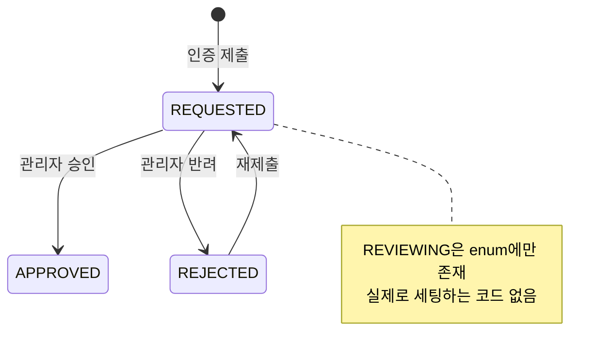
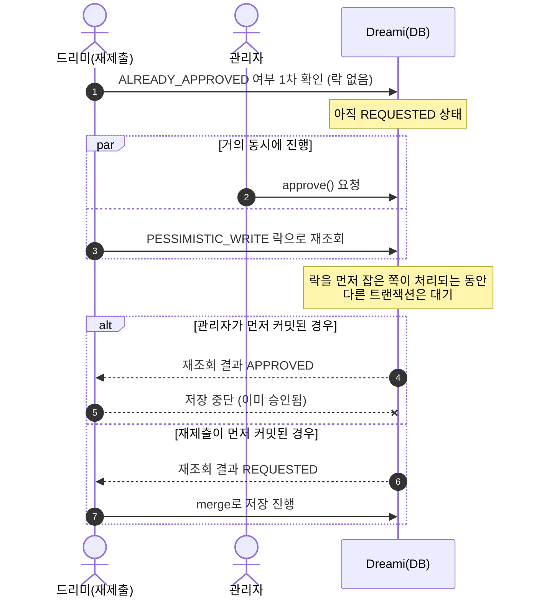
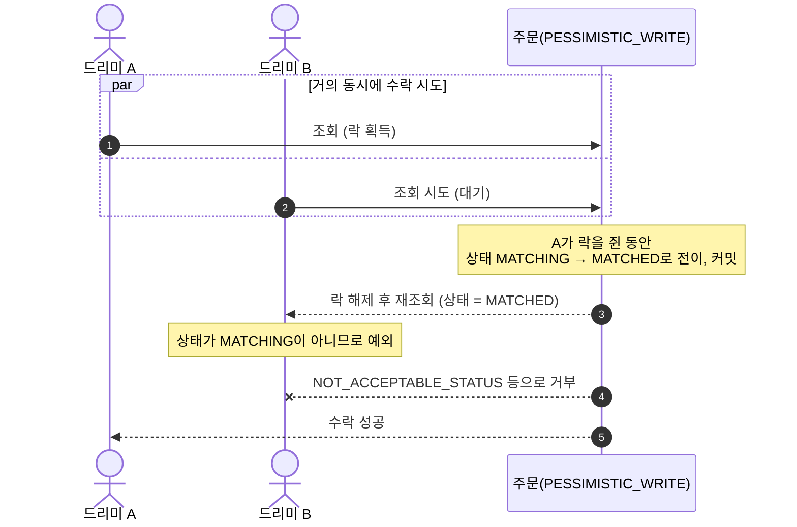
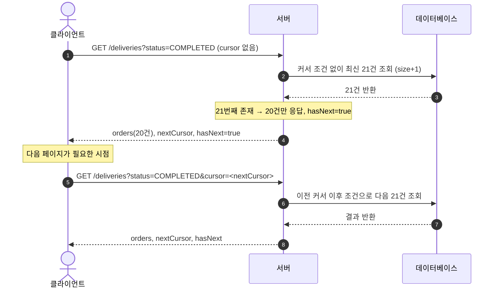

# Dreami 도메인

드리미(배달을 수행하는 역할)의 인증, 온라인/오프라인 전환, 오퍼(제안) 수락/거절, 주변 콜 조회, 대시보드/활동내역/프로필을 담당합니다.
한 사람이 부르미(주문자)이자 드리미일 수 있어서, `Dreami`의 PK는 `Boormi`와 **동일한 UUID**를 그대로 씁니다.

## 1. `Dreami` 엔티티와 상태

```
dreamiId          UUID (PK, boormiId와 동일)
requestCd         REQUESTED | REVIEWING | APPROVED | REJECTED
idCardKey / criminalRecordKey   S3 key (업로드 도메인 참고)
rejectDetail      최신 반려 사유
requestDtm / reviewDtm
dreamiAvgScore    DECIMAL(3,2), 기본 0
```

`REVIEWING`은 enum에 정의만 있고 실제로 세팅하는 코드는 없습니다. 실사용은 `REQUESTED`(신청 직후) → `APPROVED`/`REJECTED`(관리자 처리) 두 단계뿐입니다.



"인증 승인 여부"(`Dreami.requestCd`)와 "드리미 기능 활성화 여부"(`Boormi.isDreamiActivate`)는 별개 필드입니다. 관리자가 승인할 때 **둘 다 같이 바뀌어야** 드리미 기능이 실제로 켜집니다.

`DreamiRequestDeniedDetails`는 반려할 때마다 row를 쌓는 이력 테이블입니다. `Dreami.rejectDetail`은 "최신 사유" 하나만 갖고, 누적 반려 횟수는 이 테이블 count로 구합니다(프로필 조회에서 사용).

## 2. 드리미 인증 흐름 (제출 → 검수 → 승인/반려)

### 제출 — `POST /api/v1/dreami/verification`

1. 이미 승인된 드리미면 `ALREADY_APPROVED`로 먼저 걸러냅니다.
2. 신분증/범죄이력조회서 각각의 업로드 key를 [Upload 도메인](../upload/overview.md)의 `checkUpload`로 검증합니다(실제 업로드됐는지 + 소유자/용도 일치).
3. 둘 중 하나라도 새로 검증에 성공하면 저장합니다. 재제출로 하나만 다시 올린 경우(예: 범죄이력조회서만 재업로드)에도 저장은 일어나며, **둘 다 이미 처리된 재시도일 때만** 저장을 건너뜁니다.
4. 저장은 `PESSIMISTIC_WRITE` 락으로 다시 조회한 뒤 승인 여부를 한 번 더 확인하고 진행합니다. "승인 여부 확인"과 "저장" 사이에 관리자가 승인을 확정해버리는 레이스(TOCTOU)가 실제로 있었고, 이 락 재확인이 그 안전장치입니다.
5. 재제출은 `Dreami.create(dreamiId, ...)`로 새로 만든 엔티티를 그대로 `save()`하는데, PK(`dreamiId` = `boormiId`)가 이미 존재하는 값이라 JPA가 `persist`가 아니라 **`merge`로 처리해 같은 row를 덮어씁니다**(새 row가 생기는 게 아니라 같은 PK의 UPDATE입니다). 그 결과 상태가 `REQUESTED`로, 평점도 0으로 리셋됩니다. 이미 승인된 드리미의 재신청을 막는 이유가 여기 있습니다(리셋을 막기 위해서).

재제출 시점에 관리자가 거의 동시에 승인을 처리하면, "제출 코드가 확인한 승인 여부"와 "실제 DB 상태"가 어긋날 수 있습니다. 이를 막기 위한 재확인 락의 흐름은 다음과 같습니다.



### 검수(관리자) — `DreamiApproveController` (`/api/v1/debug/dreami-review`)

- `GET /pending` — 심사 대기(`REQUESTED`) 목록입니다. 신분증/범죄이력조회서를 다운로드 URL로 변환해 함께 내려줍니다.
- `POST /{dreamiId}/approve` — `Dreami.approve()` + `Boormi.approve()`(`isDreamiActivate = true`)를 **함께** 처리합니다.
- `POST /{dreamiId}/reject` — `Dreami.reject(reason)` + 반려 이력 저장을 처리합니다.

세 엔드포인트 전부 `@AdminUser UUID adminId` 파라미터로 관리자 인증을 요구합니다. `AdminUserArgumentResolver`가 세션이 없으면 `UNAUTHORIZED`, 로그인은 했지만 `Boormi.isAdmin()`이 false면 `FORBIDDEN_ROLE`을 던집니다 — 로그인만으로는 안 되고 관리자 계정으로 로그인해야 호출할 수 있습니다. 원래는 `DreamiReviewDebugController`라는 이름으로 `@PublicApi`(로그인 검사 자체를 건너뜀, 완전 공개) 상태였는데, "운영 배포 전 제거/비활성화 필요"라고 명시돼 있던 그 임시 상태를 이 인증 요구로 대체했습니다. `Boormi.isAdmin` 컬럼, 관리자 계정 시드용 `test-seed-accounts.sql`, 정적 관리자 페이지(`static/admin.html`)가 함께 추가됐습니다.

`DreamiActivationChecker`는 "지금 드리미로 활동 가능한가?"(`Boormi.isDreamiActivate && Dreami.requestCd == APPROVED`)만 판정하는 순수 조회 컴포넌트입니다. 서비스 계층을 참조하지 않고 리포지토리에만 의존하도록 만들었는데, 매칭↔배달↔유저 사이 순환 참조를 만들지 않기 위해서입니다.

## 3. 온라인/오프라인 전환

`POST /api/v1/dreami/status/online`

1. 드리미 미존재 → `NOT_FOUND`
2. 승인되지 않음(`requestCd != APPROVED`) → `NOT_APPROVED`
3. 본인이 부르미든 드리미든 **수행 중인 주문이 이미 있음** → `ALREADY_HAS_ACTIVE_ORDER`
4. 통과하면 매칭 엔진에 위치와 함께 등록합니다.

이미 온라인(매칭 대기 중)이어도 이 API 자체는 거부하지 않습니다 — 클라이언트의 온라인 상태는 새로고침하면 사라지는 메모리 상태라, 여기서 거부하면 화면이 "오프라인"으로 굳어버려 복구가 안 되기 때문입니다. 중복 등록 자체는 매칭 엔진 내부에서 무시됩니다.

`POST /api/v1/dreami/status/offline`은 별도 검증 없이 매칭 엔진에서 제거만 합니다.

## 4. 오퍼(제안) 수락/거절

`POST /api/v1/dreami/offers/{offerId}/accept` · `POST /api/v1/dreami/offers/{offerId}/reject`

여러 드리미가 같은 주문에 동시에 수락 버튼을 누르는 상황에서 발생한 동시성 버그를 3단계에 걸쳐 고쳤습니다.

### 1. 레이스 자체 수정

원래는 락 없이 주문을 조회해 무조건 상태를 전이시켰습니다. 부하테스트에서 200건 중 4건꼴로, 나중에 커밋된(패배한) 드리미의 트랜잭션이 이미 확정된 주문을 되돌려버리는 문제가 있었고 실제 장애로도 이어졌습니다. 주문 조회에 `PESSIMISTIC_WRITE` 락을 걸고, 락을 잡은 뒤 상태가 `MATCHING`이 아니면 예외를 던지도록 고쳤습니다.



후보로 if 가드(락 없이 상태만 확인)/낙관적 락(`@Version`)/비관적 락/`@DynamicUpdate`/조건부 UPDATE 다섯 가지를 비교한 뒤 비관적 락을 채택했습니다. 이유는 세 가지입니다: (1) 영속성 컨텍스트를 우회하지 않아 stale-read 위험이 구조적으로 없습니다, (2) 이미 팀이 같은 이유로 쓰고 있는 컨벤션(`DreamiRepository.findByDreamiId`도 `PESSIMISTIC_WRITE`)과 일치합니다, (3) 이 시나리오의 동시성 규모(한 주문에 최대 몇 명 정도가 경합)에서는 락 대기 비용이 무시할 만합니다. 조건부 UPDATE를 배제한 이유가 특히 중요한데, "지금 로직은 단순 상태 전이라 조건부 UPDATE로 충분해 보이지만, 나중에 검증 로직이 더 늘어나면(예: 수락 가능 조건 추가) 다시 락이 필요해지는 숨은 전제"라고 판단했기 때문입니다 — 당장 되는 것과 계속 안전한 것을 구분한 것입니다.

### 2. 에러 세분화

"이미 다른 드리미가 선점"과 "그 외 수락 불가 상태(취소·완료 등)"를 구분하지 않고 뭉뚱그려 안내하고 있었습니다. 원인별로 다른 에러 코드로 분리했습니다.

### 3. 멱등 처리

더블클릭이나 재시도로 **같은 드리미가 같은 오퍼를 두 번 수락**하면, 이미 자기가 성공시킨 요청인데도 "다른 드리미가 선점했다"는 잘못된 에러가 나갔습니다. 수락 시 주문에 드리미 id를 기록해두고, 재시도 시 본인 요청이면 예외 없이 조용히 통과하도록 고쳤습니다.

### 거절

거절은 소유권만 확인하고 매칭 엔진에서 거절 처리만 합니다(DB 상태 변경 없음, 주문은 계속 매칭 대기).

### 오퍼 물품 사진 조회

오퍼 물품 사진(`GET /api/v1/dreami/offers/{offerId}/item-photo`)은 수락 전이라 주문에 드리미가 아직 배정되지 않은 상태라, 매칭 엔진의 "이 오퍼의 대상 드리미인지" 판정으로 접근 권한을 확인합니다. 매칭 엔진의 SSE 발송 경로(단일 스레드)에 S3 조회를 얹지 않으려고 별도 API로 분리했습니다.

## 5. 주변 콜 리스트

`POST /api/v1/dreami/calls/nearby` — 매칭 도메인에서 위치 기준으로 가까운 주문 id/거리만 받아온 뒤, 각 주문을 다시 조회해 품목·주소·예상수익·예상 도착시간을 채워 응답합니다(매칭 도메인은 주문 상세를 갖고 있지 않기 때문입니다).

## 6. 현재 수행 중인 배달

`GET /api/v1/dreami/deliveries/current/card` — 진행 중인 주문이 없으면 예외 대신 **`null`을 반환**합니다(정상적인 상태로 취급).

드리미의 "현재 배달 취소" 기능은 이 도메인에 없습니다. 예전에는 dreami 도메인에 별도 취소 API(`DreamiController.cancelCurrentDelivery`)가 있었지만, delivery 도메인의 취소 API(`DeliveryController.cancelByDreami`)와 "드리미의 배달 취소"라는 같은 행위를 다루면서도 서로 독립적으로 구현돼 있었습니다. 실제로 프론트가 쓰는 경로(`DeliveryController` 쪽)엔 재매칭 트리거가 빠져 있어서, 취소 버튼을 눌러도 주문이 `IN_PROGRESS`에서 영원히 고착되는 문제가 있었습니다 — 같은 취소라는 행위를 두 엔드포인트가 각자 구현하고 있으면, 한쪽만 고치고 다른 쪽(혹은 그 후속 조치)을 빠뜨리기 쉽다는 교훈이 여기서 나왔습니다. 지금은 `DeliveryController`의 취소 API 하나로 통합·정리됐습니다.

## 7. 대시보드 / 오늘 통계

`GET /api/v1/dreami/dashboard`

- 완료 건수는 전체 기간 누적입니다.
- 최근 6개월치 정산 데이터를 **쿼리 한 번**으로 가져와 메모리에서 이번 달/전월/월별 리스트로 집계합니다(월마다 따로 쿼리하던 것을 이 방식으로 줄였습니다).
- 증감률은 전월 수익이 0이면 0%로 처리합니다(0으로 나누기 방지).
- "이번 달 완료 건수"는 원래 "시장 평균 초과 수익"이었던 자리를 대체한 값입니다.

`GET /api/v1/dreami/dashboard/today` — 오늘 하루(자정 기준)의 정산 합계와 완료 건수만 별도로 조회합니다.

## 8. 활동 내역 / 프로필

### 활동 내역 목록 — `GET /api/v1/dreami/deliveries`

`DreamiController.getDreamiOrders` → `DreamiService.getMyOrders` → `OrderService.getOrders(userId, Role.DREAMI, statusFilter, cursor, size)`로 이어집니다. `getOrders`는 부르미/드리미가 공유하는 진입점이라 `role` 파라미터 하나로 호출부는 통일돼 있지만, **실제 DB 조회는 role별로 완전히 분리된 두 쿼리**로 나뉩니다.

```java
List<OrderSummaryDto> rows;
if (role == Role.BOORMI) {
    rows = orderRepository.findPageByBoormiId(userId, orderCds, cursor.deliveryRequestDtm(),
            cursor.orderId(), pageable);
} else {
    rows = orderRepository.findPageByDreamiId(userId, orderCds, cursor.deliveryRequestDtm(),
            cursor.orderId(), pageable);
}
```

`findPageByBoormiId`/`findPageByDreamiId`를 하나로 합쳐서 `(:role='BOORMI' AND boormiId=?) OR (:role='DREAMI' AND dreamiId=?)` 같은 단일 쿼리로 만들지 않은 이유가 있습니다. 이런 파라미터 의존 OR 조건은, JDBC 드라이버가 그 값을 리터럴로 치환해서 보내느냐(`useServerPrepStmts=false`, 흔한 기본값) 진짜 바인드 파라미터로 보내느냐(`useServerPrepStmts=true`)에 따라 MySQL 옵티마이저가 죽은 분기를 상수 접기로 지워줄 수도, 못 지워서 두 컬럼 인덱스 어느 쪽도 확정적으로 못 타고 풀스캔으로 떨어질 수도 있습니다. 이 둘 중 어느 쪽으로 동작하는지는 이 쿼리 코드가 아니라 커넥션 설정에 달린 문제라서, role별로 쿼리 자체를 나눠서 각자 자기 인덱스만 확정적으로 타게 만들었습니다.

`ORDERS`에는 이를 위한 복합 인덱스가 있습니다.

```sql
CREATE INDEX `IX_ORDERS_DREAMI_LIST` ON `ORDERS` (`dreami_id`, `delivery_request_dtm` DESC, `order_id` DESC);
CREATE INDEX `IX_ORDERS_BOORMI_LIST` ON `ORDERS` (`boormi_id`, `delivery_request_dtm` DESC, `order_id` DESC);
```

등가 조건 컬럼(`dreami_id`/`boormi_id`)을 선두에 둬서 그 사용자 행으로 좁히고, 그 뒤에 정렬 컬럼을 그대로 둬서 `ORDER BY delivery_request_dtm DESC, order_id DESC`가 filesort 없이 인덱스 순서 그대로 나오게 합니다.

#### 왜 전체 반환에서 커서 페이지네이션으로 바뀌었는지

예전엔 `LIMIT` 없이 그 사용자의 전 기간 배달 이력을 `SELECT *`로 통째로 가져왔습니다. 이력이 쌓일수록 매번 더 많은 행을 스캔·정렬·반환하는 구조였고, `Orders` 엔티티 전체를 매핑하다 보니 응답에 쓰이지도 않는 `route_path`(카카오 경로 좌표 JSON) 같은 대형 컬럼까지 행마다 읽어서 버리는 낭비도 있었습니다. 지금은 `OrderSummaryDto` 생성자 표현식으로 필요한 컬럼만 바로 투영하고, 커서 조건(`deliveryRequestDtm < :cursorDtm OR (= AND orderId < :cursorId)`)으로 한 페이지씩만 가져옵니다. 오프셋(`LIMIT n OFFSET m`)이 아니라 커서를 쓴 이유는, 오프셋은 뒷페이지로 갈수록 앞부분을 다 스캔하고 버려야 해서 느려지고 스크롤 중 새 행이 끼어들면 항목이 밀리는데, 커서는 인덱스로 위치를 바로 찾아가 몇 페이지째든 비용이 같고 밀림도 없기 때문입니다.

파라미터는 다음과 같습니다.

- `status`(선택, 여러 값 가능): 생략하면 `OrderCd.values()` 전체로 채워 넣어 상태 무관 전체를 반환하고, 지정하면 그 상태들만 반환합니다. 화면의 필터 탭 하나가 여러 orderCd를 묶는 경우(예: "진행중" = MATCHING/PENDING_BOORMI_CONFIRMATION/IN_PROGRESS/WAITING_CONFIRMATION) 그 값들을 한꺼번에 넘기면 됩니다.
- `cursor`(선택): 이전 응답의 `nextCursor`를 그대로 넘기면 다음 페이지를 이어 받습니다. `OrderCursor`가 `(deliveryRequestDtm, orderId)`를 Base64 opaque 문자열로 인코딩/디코딩합니다. 첫 페이지는 생략(또는 빈 값)하고, 형식이 깨진 값만 `INVALID_CURSOR`로 거부합니다.
- `size`(선택): 페이지 크기(기본 20, 최대 50)입니다. 요청한 크기보다 하나 더(`+1`) 가져와 봐서 그 여분이 있으면 `hasNext=true`로 잘라내고, 없으면 그대로 돌려주는 방식으로 `hasNext`를 판단합니다.

응답(`BoormiOrdersResponse`)은 `orders`/`nextCursor`/`hasNext` 세 필드입니다.



#### 관련 엔드포인트

- `GET /api/v1/dreami/deliveries/{orderId}` — 단건 조회입니다. 목록이 커서 페이지네이션이라 특정 건이 몇 페이지째에 있는지와 무관하게, 딥링크/새로고침으로 상세에 바로 들어갈 수 있게 합니다.
- `GET /api/v1/dreami/deliveries/count` — 상태 무관 전체 건수입니다(목록이 일부만 노출될 때 "총 N건" 표시용).
- `GET /api/v1/dreami/deliveries/status-counts` — 활동 내역 화면의 탭(전체/진행중/완료/취소)별 개수입니다. `GROUP BY order_cd`로 한 번에 집계해서, 목록 페이지네이션과 별개로 화면 진입 시 한 번만 호출하면 됩니다(탭 전환마다 다시 세지 않습니다).
- `GET /api/v1/dreami/{dreamiId}` — 다른 사람(부르미)이 드리미 프로필을 조회할 때 씁니다. 이름·평점·누적 반려 횟수를 함께 내려줍니다.

## 9. 에러 코드 (`DreamiErrorCode`)

| 코드 | HTTP | 상황 |
|---|---|---|
| `NOT_FOUND` | 404 | 드리미/부르미 미존재 |
| `ALREADY_APPROVED` | 409 | 이미 승인된 드리미가 재신청 |
| `NOT_APPROVED` | 403 | 미승인 드리미가 온라인 전환 시도 |
| `ALREADY_HAS_ACTIVE_ORDER` | 409 | 수행 중인 주문이 있는 채로 온라인 전환 시도 |

오퍼 관련 에러(`ALREADY_ACCEPTED_BY_OTHER`, `NOT_ACCEPTABLE_STATUS`, `NOT_OFFER_OWNER` 등)는 매칭 도메인의 에러 코드입니다.

## 10. 참고

- 이 도메인은 [Upload 도메인](../upload/overview.md)(인증 파일 검증)과 [Address 도메인](../address/overview.md)(주변 콜의 주소·거리)에 의존합니다.
- 드리미 GPS 끊김 감지처럼 이 도메인과 맞닿아 있지만 이번에 다루지 않은 기능은 [docs/hyeonseong/dreami-offline-detection.md](../../hyeonseong/dreami-offline-detection.md)에 별도로 정리되어 있습니다.
