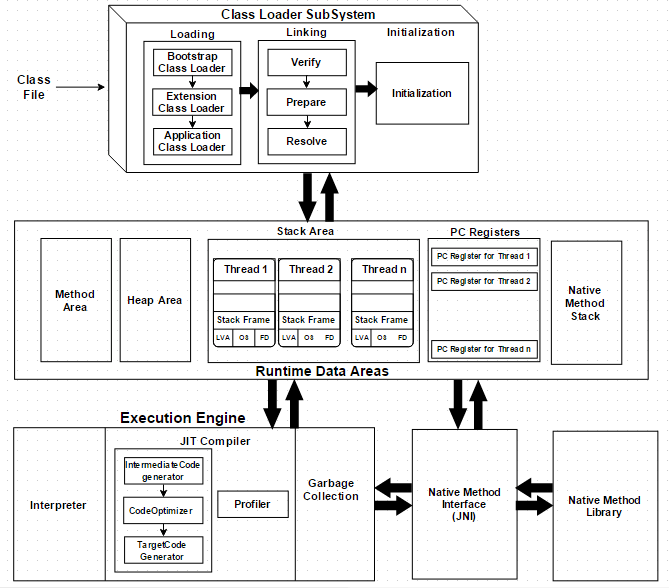

# Java JVM & Class/Reflection 개념 정리

JVM의 구조(클래스 로더, 런타임 데이터 영역, 실행 엔진)와, `Class` 객체·Reflection API를 정리.

## 목차

1. [Java Virtual Machine](#1-java-virtual-machine)
2. [Compile vs Interpreter Language](#2-compile-vs-interpreter-language)
3. [Class Loader Subsystem](#3-class-loader-subsystem)
4. [Runtime Data Area](#4-runtime-data-area)
5. [Execution Engine](#5-execution-engine)
6. [바이트코드·static 변수·인스턴스 변수는 어디에 언제 저장되나](#6-바이트코드static-변수인스턴스-변수는-어디에-언제-저장되나)
7. [Java Class](#7-java-class)
8. [Java Reflection](#8-java-reflection)
9. [Reflection 주요 API](#9-reflection-주요-api)

---

## 1. Java Virtual Machine

JVM(Java Virtual Machine)은 컴퓨터가 Java 프로그램을 실행할 수 있게 해주는 가상 머신(소프트웨어
구현체)이다.

**Q. JVM이 왜 필요한가요?**

**Write Once, Run Anywhere**를 실현하기 위해서다. Java 소스코드는 특정 OS/하드웨어용 기계어가 아니라
**바이트코드**로 컴파일되고, 이 바이트코드를 실제로 실행하는 건 각 플랫폼별로 구현된 JVM이다. 즉
개발자는 한 번만 컴파일하면 되고, "이 플랫폼에 맞게 바이트코드를 해석·실행하는" 책임은 JVM이
플랫폼마다 대신 진다. 이 구조 덕분에 자바뿐 아니라 **바이트코드로 컴파일될 수 있는 다른 언어**(Kotlin,
Scala, Groovy 등)도 같은 JVM 위에서 실행할 수 있다. 그 외에도 JVM은 자동 메모리 관리(Garbage
Collection), 실행 중 보안 검증(Class Loader의 바이트코드 검사) 같은 부가 기능을 실행 계층에서
공통으로 제공한다.

---

## 2. Compile vs Interpreter Language

**Q. Java는 컴파일 언어인가, 인터프리터 언어인가? 이유는?**

**둘 다 걸쳐 있는 하이브리드 방식이다.**

1. **컴파일 단계**: `javac`가 `.java` 소스코드를 플랫폼 독립적인 **바이트코드**(`.class`)로 컴파일한다.
   이 시점까지는 전형적인 컴파일 언어와 같다.
2. **실행 단계**: JVM이 이 바이트코드를 실행하는데, 기본적으로는 **인터프리터**가 바이트코드를 한 줄씩
   해석해 실행한다. 여기에 더해 **JIT(Just-In-Time) 컴파일러**가 반복적으로 많이 실행되는 "핫스팟"
   코드를 그때그때 실제 기계어(네이티브 코드)로 컴파일해 캐싱함으로써, 매번 해석하는 것보다 훨씬 빠르게
   실행되게 한다.

즉 "소스 → 바이트코드"는 컴파일이고, "바이트코드 → 실행"은 인터프리터 + JIT 컴파일이 섞인 방식이라,
Java는 순수 컴파일 언어도 순수 인터프리터 언어도 아닌 **하이브리드**로 보는 것이 정확하다.

---

## 3. Class Loader Subsystem

Class Loader Subsystem은 클래스를 **동적으로** 로딩할 수 있게 해준다(전체 프로그램을 한 번에 메모리에
올리는 게 아니라, 필요한 클래스를 필요한 시점에 로딩).

### Class Loading 단계와 역할

**Q. Class Loading의 순서와 각 단계의 역할은?**

1. **Loading**: 클래스 정보(FQCN, Fully Qualified ClassName 기준)를 찾아 메모리(Method Area)에
   로딩하고, 그 클래스를 대표하는 `Class` 객체를 힙(Method Area)에 생성한다.
2. **Linking**: 로딩된 클래스 파일이 유효한지 검사(바이트코드 형식 검증)하고, 정적(static) 변수를
   일단 **기본값**(0, null, false 등)으로 메모리에 채워둔다.
3. **Initialization**: 정적 변수를 소스코드에 실제로 지정된 **초기값**으로 채우고, `static` 블록을
   실행한다.

### Class Loader 계층 구조

**Q. Class Loader의 종류와 각 역할은?**

세 계층이 **위임 모델(delegation model)**로 동작한다 — 클래스를 로딩할 때 먼저 상위 로더에게 위임하고,
상위 로더가 못 찾을 때만 자기 자신이 로딩을 시도한다.

- **Bootstrap Class Loader**: JVM에 내장된 최상위 로더로, `java.lang`, `java.util` 같은 핵심 JDK
  클래스를 로딩한다. 네이티브 코드로 구현돼 있어 자바 클래스로 표현되지 않는다.
- **Extension(Platform) Class Loader**: 확장 라이브러리(JDK의 확장 디렉터리/플랫폼 모듈)를 로딩한다.
- **Application Class Loader**: 개발자가 작성한 애플리케이션 클래스(클래스패스에 있는 것들)를
  로딩한다. 보통 우리가 짠 코드는 이 로더가 로딩한다.

---

## 4. Runtime Data Area

**Q. Runtime Data Area를 구성하는 요소들을 나열하고 각 역할을 설명해 주세요.**

- **Method Area**: 클래스 정보(필드/메서드/상수풀/`static` 변수 등)를 저장한다. 여러 스레드가
  공유하는 영역이다.
- **Heap Area**: `new`로 생성되는 객체 인스턴스가 저장되는 영역. Method Area와 마찬가지로 모든
  스레드가 공유한다. GC가 관리하는 대상도 여기다.
- **Stack**: 스레드마다 하나씩 생성된다. 메서드 호출마다 스택 프레임이 쌓이고, 그 프레임 안에 지역
  변수·연산 중간값·메서드 호출 정보가 담긴다. 스레드 전용(공유 안 됨)이라 동시성 이슈에서 자유롭다.
- **PC(Program Counter) Register**: 스레드마다 생성되며, 현재 실행 중인 바이트코드 명령의 주소를
  저장한다. 스레드 전환(컨텍스트 스위칭) 후 어디부터 다시 실행할지 이 값으로 알 수 있다.
- **Native Method Stack**: 자바가 아닌 네이티브 메서드(JNI 등)를 호출할 때 사용하는 스택.

---

## 5. Execution Engine

**Q. Execution Engine을 구성하는 요소들을 나열하고 각 역할을 설명해 주세요.**

- **Interpreter**: 바이트코드를 한 줄씩 순서대로 해석해 실행한다. 구현이 단순하지만, 같은 코드를 매번
  다시 해석하므로 반복 실행되는 코드에는 느리다.
- **JIT(Just-In-Time) 컴파일러**: 자주 실행되는("핫스팟") 코드를 감지해 실제 기계어(네이티브 코드)로
  컴파일하고 캐싱해둔다. 이후로는 해석 없이 네이티브 코드를 바로 실행하므로 훨씬 빠르다.
- **Garbage Collection**: 더 이상 참조되지 않는(사용되지 않는) 힙 객체를 자동으로 찾아 회수해 메모리
  효율을 높인다. 개발자가 직접 메모리를 해제하지 않아도 되는 이유다.

---

## 6. 바이트코드·static 변수·인스턴스 변수는 어디에 언제 저장되나

- **바이트코드**: 클래스 로딩의 **Loading** 단계에서 **Method Area**에 저장된다. JVM이 실행하는 내내
  이 영역에 머문다.
- **static 변수**: **Method Area**에 저장된다. 시점이 두 단계로 나뉘는 게 포인트다 — **Linking**의
  검사 단계에서 먼저 **기본값**(0, null 등)으로 자리만 잡히고, **Initialization** 단계에서 실제
  소스코드에 지정된 **초기값**으로 채워진다.
- **인스턴스 변수(필드)**: **Heap**에 저장된다. 클래스가 로딩되는 시점이 아니라, 그 클래스의 인스턴스가
  `new`로 **실제로 생성되는 시점**에 힙에 할당된다. 인스턴스가 여러 개면 필드 값도 인스턴스마다
  독립적으로 힙에 따로 존재한다(static 변수가 클래스당 하나만 존재하는 것과 대조된다).

---

## 7. Java Class

`java.lang.Class`는 클래스·인터페이스의 **런타임 시 표현 객체**다. 타입 정보를 담고 있으며,
**Reflection을 활용한 동적 프로그래밍의 첫 진입점**이다.

**주요 기능**:
- 타입 정보 조회(이름, 패키지, 상속 구조)
- 멤버 탐색(필드, 메서드, 생성자)
- 동적 객체 생성(`newInstance` 계열)
- 타입 검사 및 캐스팅(`isInstance`, `cast`)
- 애노테이션 읽기
- 리소스 로딩(`getResource`)

**특징**:
- 클래스 로딩이 실행되는 시점에 **싱글턴 객체**로 생성된다(같은 클래스면 `Class` 객체도 항상 동일).
- JVM의 **Method Area**에 생성된다.
- **Immutable** 객체다(한 번 만들어진 `Class` 객체의 정보는 바뀌지 않는다).

**`Class` 객체가 담고 있는 정보**:
- 클래스 이름과 패키지 정보
- 슈퍼클래스와 구현 인터페이스
- 필드, 메서드, 생성자 목록
- 애노테이션 정보
- 접근 제어자(modifier)

---

## 8. Java Reflection

**Reflection**(반사)이란, 프로그램이 **자기 자신의 구조를 검사하고 수정할 수 있는 능력**이다. 컴파일된
클래스 정보를 활용해 런타임에 클래스·인터페이스·필드·메서드 정보에 접근하는 API를 말한다.

**주요 기능**:
- 클래스 정보 조회
- 객체 동적 생성
- 메서드 동적 호출
- 필드 값 읽기/쓰기
- 접근 제어자 무시(`private` 필드/메서드에도 접근 가능하게 강제로 열기)

**Reflection이 필요한 상황**:
- 컴파일 타임에 타입을 알 수 없을 때
- 플러그인 아키텍처를 구현할 때
- 프레임워크/라이브러리를 개발할 때
- 직렬화/역직렬화를 구현할 때

**대표적인 예시**:
- JUnit이 `@Test` 애노테이션이 붙은 메서드를 찾아 단위 테스트로 실행하는 것
- 현재 실행 중인 클래스의 클래스·필드·메서드 정보를 알아내는 것
- 인자로 전달받은 클래스의 인스턴스를 만든 뒤 메서드를 실행하는 것(프레임워크가 사용자 클래스를
  다루는 방식)
- IDE(Eclipse/IntelliJ)가 필드 정보를 보고 getter/setter 메서드를 자동으로 만들어주는 기능
- DB에서 조회한 결과의 컬럼 이름과 자바 클래스의 필드 이름이 같을 때 자동으로 매핑해주는 ORM 동작

**장단점**:
- **장점**: 유연성, 확장성, 범용성 — 어떤 타입이 올지 몰라도 동작하는 범용 코드를 짤 수 있다.
- **단점**: 성능 저하(런타임에 타입을 조회/검사하는 오버헤드), 보안 문제(`private` 접근 제한을
  우회할 수 있음), 컴파일 타임 타입 체크를 못 받는다(오타·타입 불일치가 런타임에야 드러남).

---

## 9. Reflection 주요 API

- **`java.lang.reflect.Constructor`**
  - `getName()`: 생성자 이름 반환
  - `getModifiers()`: 접근 제어자를 숫자(비트마스크)로 반환
  - `getParameterTypes()`: 생성자 파라미터들의 데이터 타입 반환
- **`java.lang.reflect.Field`**
  - `getName()`: 필드 이름 반환
  - `getModifiers()`: 필드의 접근 제어자를 숫자로 반환
- **`java.lang.reflect.Method`**
  - `getName()`: 메서드 이름 반환
  - `getModifiers()`: 메서드의 접근 제어자를 숫자로 반환
  - `getParameterTypes()`: 메서드 파라미터들의 데이터 타입 반환
- **`java.lang.annotation.Annotation`**: 클래스·필드·메서드에 붙은 애노테이션 정보를 읽을 때 사용한다
  (`getAnnotation(Class)`, `isAnnotationPresent(Class)` 등을 `Class`/`Field`/`Method`가 함께 제공).

---

## 참고자료

- [GeeksforGeeks — JVM Works & JVM Architecture](https://www.geeksforgeeks.org/jvm-works-jvm-architecture/)
- [DZone — JVM Architecture Explained](https://dzone.com/articles/jvm-architecture-explained)
- [Wikipedia — Java virtual machine](https://en.wikipedia.org/wiki/Java_virtual_machine)
