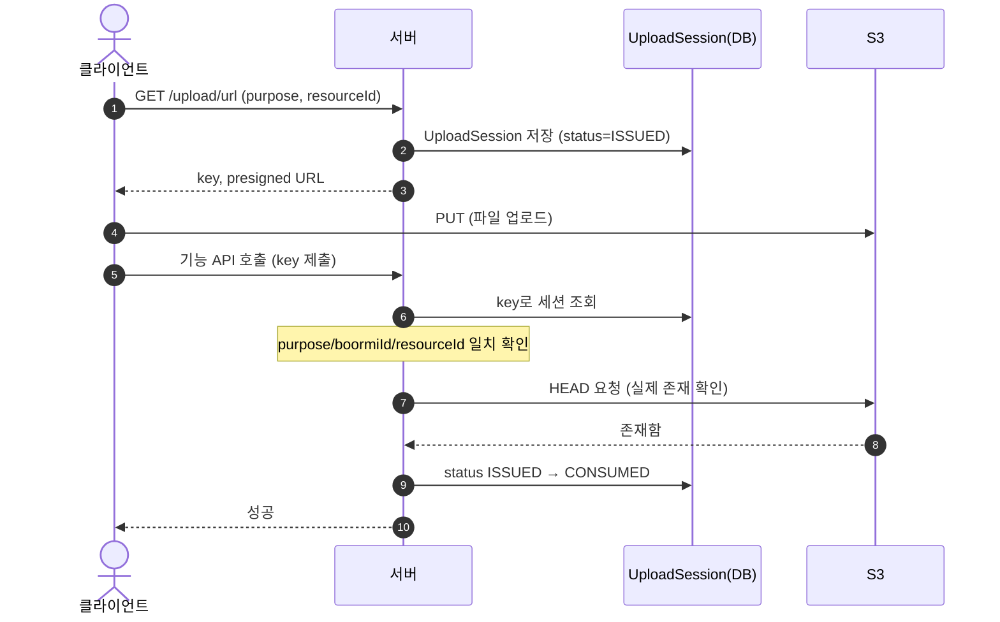
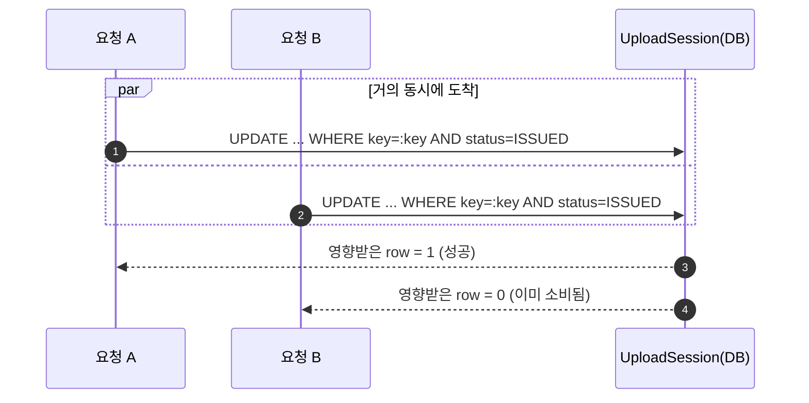
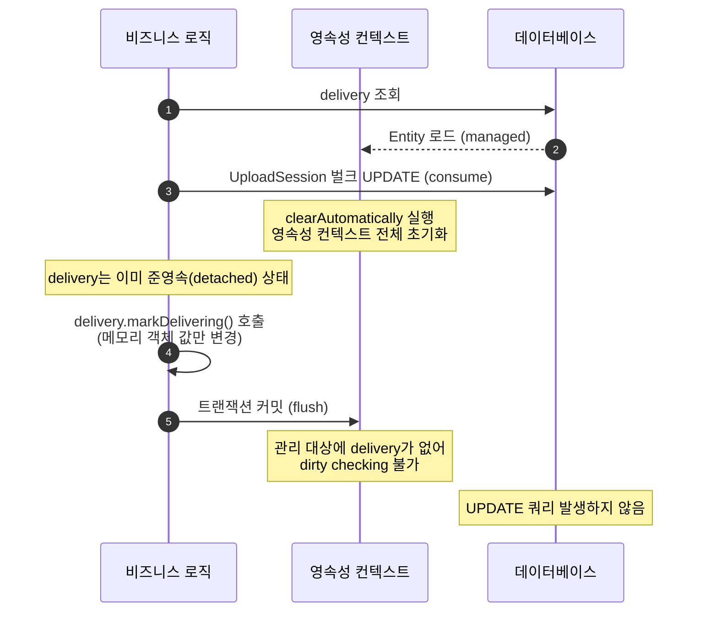
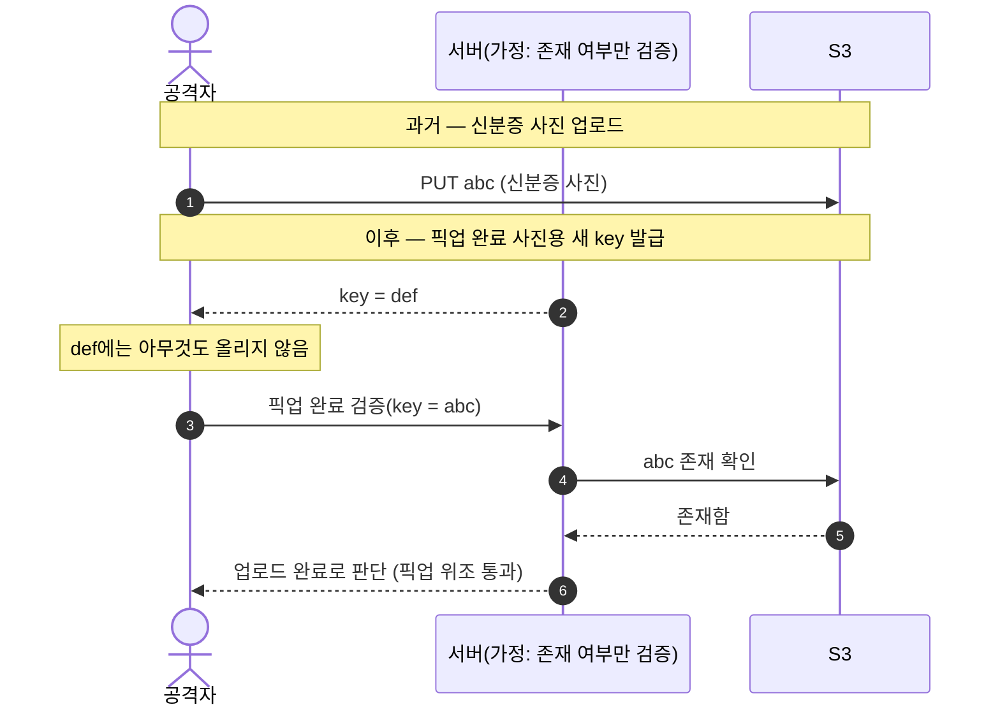
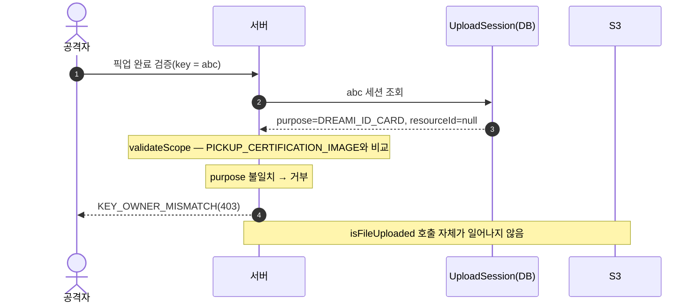
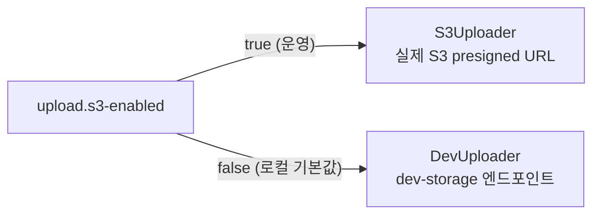
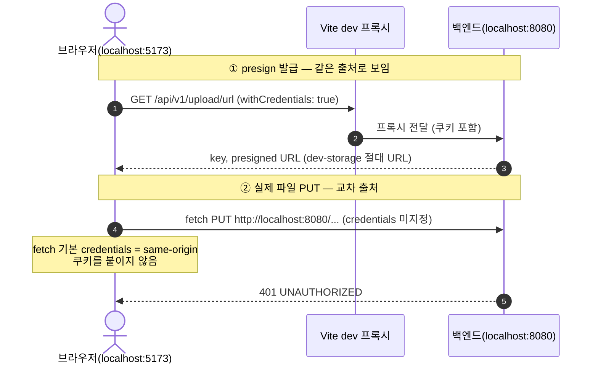

# Upload 도메인

파일(사진) 업로드를 서버가 대신 받지 않고, **presigned URL**로 클라이언트가 S3에 직접 올리게 하는 도메인입니다.
서버는 "업로드해도 되는 URL을 발급"하고, 나중에 "그 URL로 실제로 업로드가 됐는지"를 검증하는 역할만 합니다.

## 1. 전체 흐름

1. 클라이언트가 `GET /api/v1/upload/url?fileName=...&purpose=...&resourceId=...` 호출 → 서버가 S3 presigned PUT URL과 `key`를 발급하고, DB에 `UploadSession`을 `ISSUED` 상태로 저장합니다.
2. 클라이언트는 그 URL로 파일을 **직접 S3에 PUT**합니다. 파일 바이트는 서버를 거치지 않습니다.
3. 클라이언트는 그 `key`를 실제 기능 API(드리미 인증 제출, 픽업/배달 완료 인증 등)에 함께 제출합니다. 해당 API는 `UploadSessionService.checkUpload(purpose, boormiId, resourceId, key)`를 호출해
    - key가 발급 당시 기록한 `purpose`/`boormiId`/`resourceId`와 일치하는지 확인하고,
    - S3에 실제로 파일이 존재하는지 HEAD 요청으로 확인한 뒤,
    - 세션을 `ISSUED → CONSUMED`로 바꿔 "한 번 소비됐다"고 표시합니다.

이 구조가 필요한 이유는, presigned URL만 발급하고 실제로는 업로드하지 않은 채 아무 key나 추측해서 기능 API에 제출하는 것을 막기 위해서입니다. `UploadSession` row가 없거나, S3에 실제 파일이 없거나, 소유자/용도/대상이 다르면 전부 거부됩니다.



## 2. API

| Method | Path | 설명 |
|---|---|---|
| GET | `/api/v1/upload/url` | presigned URL 발급 (로그인 필요) |
| PUT/GET | `/api/v1/upload/dev-storage?key=...` | 로컬 개발용 — S3 대신 인메모리 저장소에 업로드/다운로드 (`DevStorageController`, `upload.s3-enabled=false`일 때만 활성화) |

`fileName`에 `/`, `\`, `..`가 들어가면 `INVALID_FILE_NAME`으로 거부합니다(경로 조작으로 엉뚱한 S3 key 경로를 만드는 것 방지).

## 3. `UploadSession`

```
uploadSessionId  UUID (PK)
boormiId         UUID   — 발급 요청자
purpose          UploadPurpose
resourceId       UUID?  — 이 업로드가 속한 대상(주문 등), purpose에 따라 필수/불필요
s3Key            String (unique)
status           ISSUED | CONSUMED
issuedDtm / consumedDtm
```

`purpose`별로 `resourceScopeRequired` 여부가 다릅니다.

| Purpose | resourceId 필요 | 용도 |
|---|---|---|
| `ORDER_ITEM_IMAGE` | 아니오 | 주문 생성 중 물품 사진 (주문 전이라 아직 orderId가 없음) |
| `DREAMI_ID_CARD` | 아니오 | 드리미 인증 신분증 사진 |
| `DREAMI_CRIMINAL_RECORD` | 아니오 | 드리미 인증 범죄이력조회서 |
| `PICKUP_CERTIFICATION_IMAGE` | 예 | 픽업 완료 인증 사진 (주문에 귀속) |
| `DELIVERY_CERTIFICATION_IMAGE` | 예 | 배달 완료 인증 사진 (주문에 귀속) |

resourceId가 필요한 purpose인데 발급 요청에 안 넘기면 `MISSING_RESOURCE_ID`로 거부합니다.

## 4. 소비(consume) 동시성 처리

`markConsumedIfIssued`는 "조회 후 저장" 방식이 아니라 `UPDATE ... WHERE s3Key=:key AND status=ISSUED` 조건부 UPDATE 하나로 원자적으로 처리합니다. 같은 key로 동시에 두 요청이 들어와도 DB가 한쪽만 `1`(영향받은 row 수)을 돌려주고 나머지는 `0`을 받아, 별도 락 없이도 중복 소비를 막습니다.



### 이 조건부 UPDATE가 다른 도메인의 상태 변경을 지워버린 사고

`markConsumedIfIssued`는 `@Modifying` JPQL 벌크 UPDATE라 영속성 컨텍스트를 우회해 DB에 직접 SQL을 날립니다. 그러면 그 이전에 이미 로딩돼 있던 엔티티는 DB와 어긋난 stale 값을 들고 있게 되는데, 이걸 막으려고 처음엔 `@Modifying(clearAutomatically = true)`를 붙여 벌크 UPDATE 직후 영속성 컨텍스트 **전체**를 비우게 했습니다.

문제는 `entityManager.clear()`가 "`UploadSession`과 관련된 것만" 지우는 게 아니라 **그 순간 managed 상태인 엔티티를 전부** detach시킨다는 점이었습니다. 실제 흐름(`DeliveryService.doPickupFinishByDreami` → `pickup-finish`)은 `Delivery`를 먼저 조회해 managed 상태로 만들어 둔 채로 `checkUpload()`(→ `consume()` → `markConsumedIfIssued()`)를 호출하는데, 여기서 발생한 `clear()`가 이 완전히 무관한 `Delivery`까지 함께 detach시켜버렸습니다. 그 직후 호출되는 `delivery.markDelivering()`은 이미 detach된 객체의 필드만 바꾸는 셈이라 Hibernate가 변경을 추적하지 못하고, 커밋 시점 dirty checking에 `delivery`가 아예 빠져 UPDATE 자체가 안 나갔습니다. 응답 DTO는 (detached) 메모리 객체를 그대로 읽어 만들어지므로 `DELIVERING`으로 보이는데 DB의 `delivery_cd`는 계속 `PICKUP_NORMAL`로 남는, "성공한 것처럼 보이는데 DB만 조용히 안 바뀌는" 유실 버그였습니다.



해결은 `clearAutomatically = true`를 제거하는 것이었습니다 — `consume()`의 실제 흐름을 보면 성공 시엔 UPDATE의 반환값(`1`)만으로 바로 판단해 `UploadSession`을 다시 읽지 않고, 실패 시엔 `findByKey`로 "존재 여부"만 확인할 뿐 `status` 필드로 뭔가를 판단하지 않습니다. 즉 `clearAutomatically`가 막으려던 stale read가 **이 호출부에서는 애초에 일어날 수 없는 위험**이었던 것이라, 지워도 upload 도메인 동작은 그대로이고 `delivery` detach 문제만 사라집니다. 지금 `UploadSessionRepository.markConsumedIfIssued`에 `clearAutomatically`가 없는 게 그 결과입니다.

일반화하면, `clearAutomatically = true`(또는 `entityManager.clear()`)는 "이 리포지토리/도메인만" 비우는 게 아니라 **호출 시점의 영속성 컨텍스트 전체**를 비웁니다. 그래서 다른 도메인의 트랜잭션 한복판에서 호출될 수 있는 메서드(`consume()`이 그렇습니다 — upload 도메인 메서드지만 delivery/dreami 양쪽 트랜잭션 안에서 호출됩니다)에 이 옵션을 붙일 때는, 그 옵션이 막으려는 stale read가 **정말 이 호출부에 존재하는지**부터 확인해야 합니다. 이 사고와 진단 과정의 더 상세한 버전(코드 타임라인, 검증 절차)은 [upload-session-consume-concurrency.md](../../upload/upload-session-consume-concurrency.md)에 정리되어 있습니다.

## 5. 소유자 바인딩 / key 재사용 방지

### 막으려는 공격

presigned URL 검증을 "S3에 파일이 존재하는가"만으로 하면 다음이 성립합니다.

1. 공격자가 과거에 `abc` 키로 **신분증 사진**을 업로드해 둡니다(S3에 `abc` 객체가 실제로 존재).
2. 이후 서버가 **픽업 완료 사진** 검증용으로 새 키 `def`를 발급합니다.
3. 공격자는 `def`에는 아무것도 안 올리고, 옛 키 `abc`를 그대로 픽업 완료 검증에 제출합니다.
4. 서버가 "S3의 `abc`에 파일이 있으니 업로드 완료"라고 판단하면 → 픽업이 위조로 통과됩니다.

즉 "파일 존재 여부"만으로 검증하면, 목적이 전혀 다른 옛 키를 아무 데나 갖다 붙여 통과시킬 수 있습니다.



### 방어 — 검증을 "존재 여부"가 아니라 "발급 맥락 일치"로

- presigned URL의 `key`는 발급 시점에 `boormiId`/`purpose`/`resourceId`와 함께 `UploadSession`에 저장됩니다. 검증(`validateScope`)은 S3를 보기 전에 이 세 가지가 모두 일치하는지부터 확인하고, 하나라도 다르면 `isFileUploaded`(S3 HEAD 확인) 자체에 도달하지도 못하고 `KEY_OWNER_MISMATCH`(403)로 즉시 거부됩니다.
- 이 순서(맥락 확인 → 존재 확인) 덕분에 "S3에 파일이 있으니 통과"라는 판단이 구조적으로 일어날 수 없습니다.



| 재사용 시도 | 차단 근거 |
|---|---|
| 신분증 키 → 픽업 검증 | `purpose` 불일치 |
| 남의 키 → 내 검증 | `boormiId` 불일치 |
| 다른 주문 픽업 키 → 이 주문 픽업 검증 | `resourceId` 불일치 |

처음에는 key 문자열 자체에 `boormiId`를 접두어로 넣고 `startsWith` 검사만 했는데, 이러면 purpose나 resourceId까지는 구분할 수 없었습니다. 지금은 `UploadSession` row 전체를 비교하는 방식으로 강화되어 있습니다.

## 6. 로컬/운영 분리

- `Uploader` 인터페이스: `generateUploadUrl`, `generateDownloadUrl`, `exists`.
- **`S3Uploader`**(운영, `upload.s3-enabled=true`) — `S3Presigner`(URL만 서명해서 만들어주고, 실제 파일 전송은 클라이언트가 함)와 `S3Client`(서버가 직접 S3와 통신)를 함께 씁니다. presigned URL 발급(업로드 URL 10분, 다운로드 URL 5분 만료)은 `S3Presigner`가, 업로드 여부 확인(`headObject`)은 `S3Client`가 담당합니다 — 둘의 역할이 다릅니다: 전자는 "허락을 서명"하는 것이고 후자는 "서버가 직접 확인"하는 것입니다.
- **`DevUploader`**(로컬, 기본값) — AWS 자격증명 없이 동작합니다. "presigned URL"이 실제로는 이 앱 자신의 `/api/v1/upload/dev-storage` 엔드포인트를 가리키고, 파일은 `InMemoryFileStore`(메모리 맵, 재시작하면 사라짐)에 저장됩니다.



`upload.s3-enabled` 환경변수 하나로 전체가 전환되므로, 로컬 개발/테스트는 AWS 키 없이 그대로 돌아갑니다.

운영 환경에서는 이 `S3Uploader`가 실제로 `s3:PutObject` 등을 호출할 권한을 얻기까지 시행착오가 있었습니다 — 조직의 SCP(서비스 제어 정책)가 일반 IAM 유저의 `s3:PutObject`를 명시적으로 deny하고 있어서, 처음엔 MFA 기반 임시 자격증명으로 우회했지만 이건 시간이 지나면 만료돼 자동화(장기 운영)에 쓸 수 없었습니다. 최종적으로는 EC2 인스턴스 자체에 필요한 권한을 가진 IAM Role을 붙이는 방식으로 해결했습니다 — 인스턴스가 IAM Role을 통해 자격증명을 자동으로 갱신받으므로 만료 문제가 없습니다.

## 7. 다운로드 URL 실패 시 null로 degrade

`S3PresignService.resolveDownloadUrl`은 다운로드 URL 생성에 실패하면 예외를 던지는 대신 `null`을 반환합니다(경고 로그만 남김). 배달 완료 내역이나 관리자 검수 화면처럼 "사진을 보여줄 수 있으면 보여주는" 화면에서, 오래돼서 지워졌거나 S3 장애로 잠깐 조회가 안 되는 사진 하나 때문에 전체 페이지가 깨지지 않게 하려는 목적입니다. 반대로 업로드 완료를 검증하는 `checkUpload` 경로는 그대로 예외를 던집니다 — 이쪽은 "실제로 업로드됐는지"가 중요한 검증이라 조용히 넘어가면 안 되기 때문입니다.

## 8. `UploadErrorCode`

| 코드 | HTTP | 상황 |
|---|---|---|
| `NO_FILE_ATTACHED` | 400 | 발급 요청에 파일명이 비어있음 |
| `FILE_SIZE_EXCEEDED` | 413 | (선언만 돼 있고 아직 실제로 검사하는 곳은 없음 — 파일 크기 자체를 발급 요청에서 안 받음) |
| `UNSUPPORTED_FILE_TYPE` | 415 | 확장자가 png/jpg/jpeg/webp가 아님 |
| `STORAGE_UPLOAD_FAILED` | 500 | S3 HEAD 조회 자체가 실패(권한/장애 등) |
| `FILE_NOT_FOUND` | 404 | 세션이 없거나, 세션은 있는데 실제 파일이 없음 |
| `INVALID_FILE_NAME` | 404 | 파일명에 `/`, `\`, `..` 포함 |
| `KEY_OWNER_MISMATCH` | 403 | key의 purpose/boormiId/resourceId 불일치 |
| `MISSING_RESOURCE_ID` | 400 | resource-scoped purpose인데 resourceId 없음 |

## 9. 로컬 dev-storage PUT이 로그인 상태에서도 401 나던 문제

### dev-storage

`DevStorageController`(`/api/v1/upload/dev-storage`, PUT/GET)는 로컬 개발 환경에서 S3 자리를 대신하는, 이 앱 자신이 호스팅하는 엔드포인트입니다. `DevUploader`가 presigned URL을 발급할 때 실제 S3 주소 대신 이 컨트롤러의 URL을 그대로 돌려주고, PUT으로 올라온 파일 바이트는 `InMemoryFileStore`(key→byte[] 메모리 맵)에 저장했다가 같은 key로 GET하면 그대로 돌려줍니다. S3 SigV4 서명 같은 건 전혀 없는 "그냥 로그인 세션 하나로 지키는 메모리 저장소"라, 서버를 재시작하면 그동안 로컬에서 올린 사진들은 전부 사라집니다(`UploadSession` row는 DB에 남아있어도 실제 파일은 없는 상태가 됩니다).

### dev-storage 도입 이유

운영에서 쓰는 `S3Uploader`는 실제 AWS 자격증명과 `s3:PutObject`/`headObject` 권한이 있어야 동작하고, 이 권한을 실제로 확보하기까지도 SCP·IAM 관련 시행착오가 있었습니다. 로컬 개발마다 팀원 각자가 AWS 키를 발급받아 설정해야 한다면 온보딩 비용이 크고, 테스트 삼아 올린 파일이 실수로 운영 S3 버킷에 쌓일 위험도 있습니다. 그래서 `Uploader` 인터페이스(`generateUploadUrl`/`generateDownloadUrl`/`exists`) 뒤에 `DevUploader`를 별도 구현으로 두어, `upload.s3-enabled=false`(로컬 기본값)일 때는 AWS를 전혀 건드리지 않고도 "URL 발급 → PUT → 검증" 전체 계약을 동일하게 재현하게 만들었습니다. 덕분에 프론트/백엔드 어느 쪽 코드도 지금 실제 S3를 쓰는지 dev-storage를 쓰는지 신경 쓸 필요가 없습니다 — `upload.s3-enabled` 하나로 전체가 전환됩니다.

### 로그인 필수로 바뀐 계기

맨 처음 만들어질 때는 `DevStorageController`에 `@PublicApi`가 붙어 있었습니다. 실제 S3 presigned URL은 URL 자체에 SigV4 서명·만료시각이 박혀 있어서, 그 서명만 유효하면 로그인 여부와 무관하게 통해도 안전하다는 전제였습니다.

이후 admin 페이지 쪽 엔드포인트들을 `debug` 패키지에서 `admin` 패키지로 옮기며 정리하던 커밋 바로 다음 `@PublicApi`를 제거했습니다. dev-storage는 실제 S3와 달리 SigV4 서명 검증이 전혀 없는 "그냥 key 문자열만 맞으면 되는" 메모리 저장소라, `@PublicApi`로 열어두면 로그인 없이도 key만 추측/획득하면 누구나 읽고 쓸 수 있다는 걸 이 정리 과정에서 발견하고 바로 잠근 것입니다. Javadoc도 "실제 presigned URL과 **달리** 서명 검증이 없으므로 로그인 세션을 요구한다"로 바뀌었습니다.

문제는 이 보안 수정 자체가 아니라, 프론트의 업로드 PUT이 애초부터 세션 쿠키를 안 보내고 있었다는 점이었습니다. `@PublicApi`가 붙어 있던 동안은 로그인 여부를 아예 안 봤으니 이 누락이 드러나지 않았을 뿐이고, `@PublicApi`를 떼자마자(=로그인을 요구하기 시작하자마자) 잠재해 있던 프론트 쪽 문제가 401로 바로 노출된 것입니다.

### 증상

로그인해서 정상적으로 다른 API는 다 되는 상태에서, 드리미 픽업 인증 단계처럼 사진을 실제로 업로드하는 화면에서만 401이 났습니다.

### 원인

presigned URL 발급(`GET /api/v1/upload/url`)과 실제 파일 PUT은 별개의 요청이고, 서로 인증이 실리는 경로가 다릅니다.

- 발급 요청은 프론트의 공용 axios 인스턴스(`withCredentials: true`)로 나가고, Vite dev 프록시를 거쳐 프론트와 같은 origin(`localhost:5173`)으로 보이므로 세션 쿠키가 자동으로 실립니다.
- 반면 실제 파일 바이트를 올리는 PUT은 발급받은 절대 URL로 직접 `fetch()`하는데, 로컬 dev에서는 `DevUploader`가 이 URL을 **백엔드 자기 origin**(`http://localhost:8080/api/v1/upload/dev-storage?key=...`)으로 내려줍니다. 프론트(`5173`)에서 이 URL로 보내는 `fetch`는 교차 출처 요청이고, `fetch`의 기본 `credentials` 모드는 `same-origin`이라 쿠키를 아예 안 붙입니다.
- `DevStorageController`엔 `@PublicApi`가 없어서(로그인 세션이 필요한 게 의도된 설계) `LoginCheckInterceptor`가 쿠키 없는 이 요청을 그대로 401(`AuthErrorCode.UNAUTHORIZED`)로 튕겼습니다.



### 문제였던 코드

```ts
// frontend/src/pages/delivery-proof/ui/DeliveryProofScreen.tsx
// frontend/src/pages/verify/ui/VerifyScreen.tsx
// frontend/src/pages/request-create/ui/StepPhoto.tsx
const putRes = await fetch(url, {
  method: "PUT",
  body: file,
  headers: { "Content-Type": file.type || "application/octet-stream" },
});
```

CORS(`cors.allowed-origins=http://localhost:5173`)는 이미 credentialed 요청을 허용하고 있어서 원인이 아니었습니다 — 브라우저가 쿠키를 붙여서 보내지 않은 게 문제였을 뿐입니다.

### 검토했다가 기각한 대안

`DevStorageController`의 메서드에 `@AdminUser`를 붙여 관리자 세션만 쓰게 하는 방법도 있었습니다. 하지만 이 엔드포인트는 로컬 dev에서 S3를 대신하는 범용 저장소라 드리미/부르미 계정의 실제 사진 업로드 테스트가 전부 여길 거칩니다. `@AdminUser`를 붙이면 로그인 자체는 통과해도 role이 ADMIN이 아니라 403으로 막혀서, 일반 계정으로는 업로드 테스트 자체가 불가능해집니다. "아무나 로그인만 하면 되게" 두는 게 목적에 맞아 채택하지 않았습니다.

### 해결

세 곳의 `fetch` 호출에 `credentials: "include"`를 추가했습니다. 실 S3 presigned URL(운영)로 나가는 같은 코드에도 그대로 적용되지만, S3 origin엔 이 앱의 세션 쿠키가 애초에 없으므로 무해합니다.
